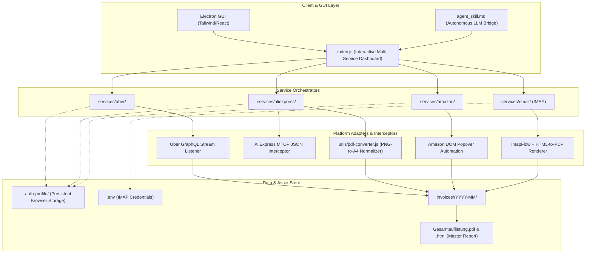

# 🏗️ System Architecture & Specifications

The **BDB Invoice & Receipt Suite** is an autonomous Node.js & Electron-based system for harvesting, normalizing, and aggregating accounting records from multiple e-commerce and mobility platforms (Uber, AliExpress, Amazon, and IMAP Emails).

---

## 🧩 Architectural Layers

---

## 🚖 1. Uber Service Architecture

1. **Persistent Browser Session:** Uses `playwright` with `channel: 'chrome'` and `--disable-blink-features=AutomationControlled` to bypass Cloudflare anti-bot checks.
2. **GraphQL Interceptor:** Monitors POST requests to `https://riders.uber.com/graphql` for operation `PastActivities`.
3. **Smart Chronological Tracking:** Iterates activities from newest to oldest. Computes true Gregorian year boundaries even when Uber omits years from display strings.
4. **Deterministic PDF Extraction:** Reads PDF text with `pdf-parse` to find exact "Steuerdatum" vs "Rechnungsdatum", Netto, USt, and Brutto.

---

## 🛍️ 2. AliExpress Service Architecture

1. **MTOP Gateway Interception:** Listens to Alibaba's MTOP endpoints (`mtop.aliexpress.buyer.order.list`) for structured financial metadata.
2. **Robust DOM Pagination:** Uses a bulletproof 150-pass, 3-second DOM-aware lazy-load clicker to handle massive accounts.
3. **PNG-to-PDF Normalization Pipeline:**
   - Detects direct PDF download button on order detail page.
   - If only PNG/Canvas receipt is provided, captures the raster buffer and embeds it losslessly into an A4 vector container via `pdfkit`.
   - Names files deterministically as `AliExpress-YYYY-MM-DD-<ORDER_ID>.pdf`.

---

## 📦 3. Amazon Service Architecture

1. **DOM Popover Automation:** Navigates Amazon's complex DOM, bypassing standard print dialogs to fetch original Amazon PDF invoices directly from the popovers.
2. **Regex Text Extraction:** Parses order numbers, dates, and EUR amounts deterministically.

---

## 📧 4. E-Mail IMAP Scraper

1. **ImapFlow Integration:** Connects directly to any IMAP server.
2. **JSON-driven Provider Configs:** Uses dynamic `.json` regex configs (e.g. `bolt.json`, `lime.json`) to find relevant receipts by sender and subject.
3. **Headless Playwright PDF Rendering:** Dynamically renders HTML emails into clean A4 PDFs, stripping out footers and unnecessary clutter.

---

## 📁 5. Unified File Storage (YYYY-MM Routing)

All scrapers strictly route downloaded PDFs into a chronological subfolder structure:
`invoices/<service_name>/YYYY-MM/<FileName>.pdf`
The unified Master Analyzer performs a recursive search across all subdirectories to safely compile the global ledger and `.html` / `.pdf` reports.
