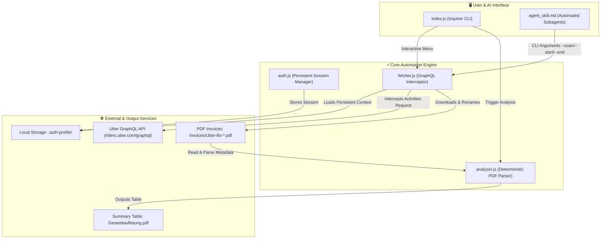

# 🏗️ Architecture & Signal Flow

The **Uber Invoice Agent** is engineered for resilience against Uber's dynamic single-page web app changes, Cloudflare bot challenges, and virtualized DOM containers.

---

## 🔄 System Architecture Diagram



---

## 🧩 Component Breakdown

### 1. `fetcher.js` (GraphQL Network Interception)
- **Problem**: DOM scraping breaks when Uber updates React CSS classes, uses virtual scrolling, or changes button links.
- **Solution**: Listens directly on Playwright's `page.on('response')` stream for POST requests to `https://riders.uber.com/graphql`.
- **Payload Extraction**: Parses `data.activities.past.activities[]` payloads to extract trip UUID, subtitle date, title, price, and cardURL.
- **Chronological Year Tracking**: Walks backwards from the current date. When months jump forwards (e.g. from March to November), it dynamically decrements the inferred year.

### 2. `auth.js` / `.auth-profile/`
- Uses `chromium.launchPersistentContext()` to preserve cookies, localStorage, and token sessions without hardcoding brittle user agents that trigger Cloudflare CAPTCHAs.

### 3. `analyzer.js` (Deterministic PDF Parsing)
- Uses `pdf-parse` to extract exact tax metadata (Rechnungsnummer, Rechnungsdatum, Steuerdatum, Netto, USt, Brutto, USt-Satz, Distanz, Anbieter).
- Uses `pdfkit` to generate a landscape A4 financial table summary without requiring an external LLM API.

---

## 📁 File Structure

```text
uber-invoice-agent/
├── .openwiki/                # Living codebase wiki documentation
│   ├── quickstart.md
│   ├── architecture.md
│   ├── decisions.md
│   └── release_notes.md
├── invoices/                 # Downloaded tax invoices (gitignored)
├── .auth-profile/            # Persistent browser session storage (gitignored)
├── agent_skill.md            # AI agent capability definition
├── analyzer.js               # Zero-token PDF extraction & report generator
├── auth.js                   # Interactive session initialization
├── fetcher.js                # Core scraper & GraphQL interceptor
├── index.js                  # Main interactive CLI interface
├── install.sh                # macOS & Linux installation script
├── install.ps1               # Windows PowerShell installation script
├── package.json              # Project dependencies and script shortcuts
└── README.md                 # Project showcase and documentation entrypoint
```
