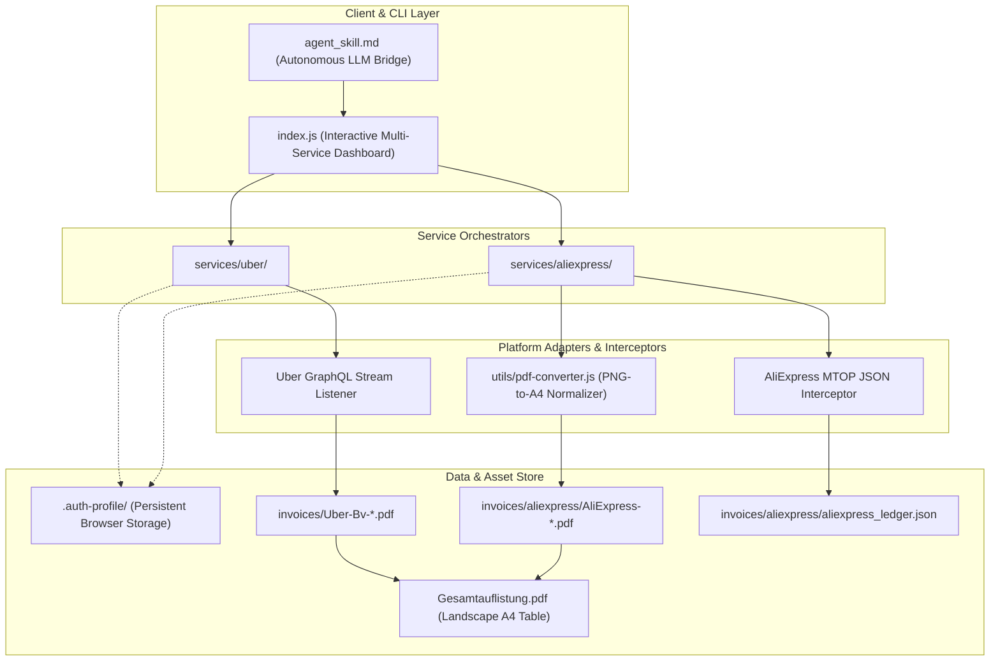

# 🏗️ System Architecture & Specifications

The **BDB Invoice & Receipt Suite** is an autonomous Node.js-based system for harvesting, normalizing, and aggregating accounting records from multiple e-commerce and mobility platforms.

---

## 🧩 Architectural Layers

---

## 🚖 1. Uber Service Architecture

1. **Persistent Browser Session:** Uses `playwright` with `channel: 'chrome'` and `--disable-blink-features=AutomationControlled` to bypass Cloudflare anti-bot checks.
2. **GraphQL Interceptor:** Monitors POST requests to `https://riders.uber.com/graphql` for operation `PastActivities`.
3. **Smart Chronological Tracking:** Iterates activities from newest to oldest. Computes true Gregorian year boundaries even when Uber omits years from display strings.
4. **Deterministic PDF Extraction:** Reads PDF text with `pdf-parse` to find `Rechnungsnummer`, `Rechnungsdatum`, Netto, USt, and Brutto.

---

## 🛍️ 2. AliExpress Service Architecture

1. **MTOP Gateway Interception:** Listens to Alibaba's MTOP endpoints (`mtop.aliexpress.buyer.order.list`) for structured financial metadata.
2. **PNG-to-PDF Normalization Pipeline:**
   - Detects direct PDF download button on order detail page (`/p/order/detail.html?orderId=...`).
   - If only PNG/Canvas receipt is provided, captures the raster buffer and embeds it losslessly into an A4 vector container via `pdfkit`.
   - Names files deterministically as `AliExpress-YYYY-MM-DD-<ORDER_ID>.pdf`.
3. **Structured Financial Ledger:** Maintains an updated `aliexpress_ledger.json` and compiles a landscape summary PDF (`Gesamtauflistung.pdf`).
