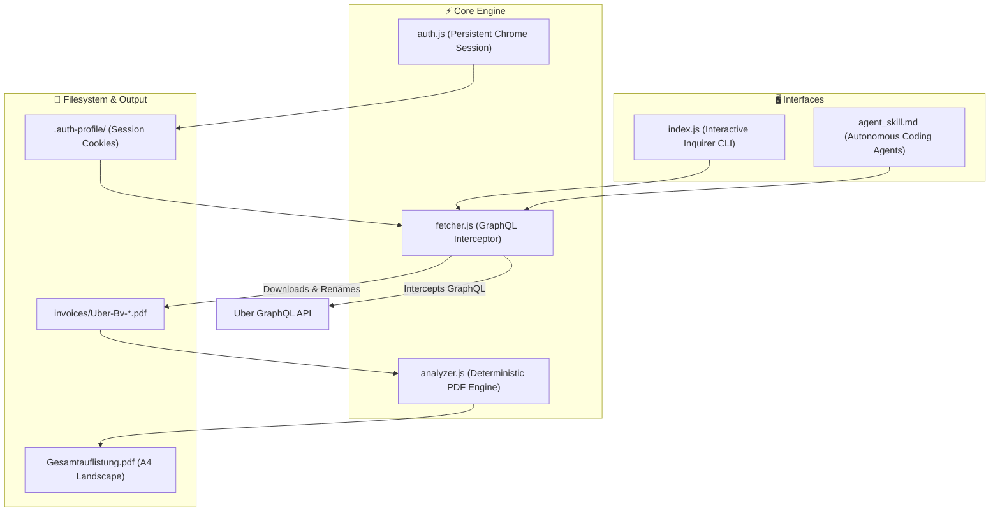

```text
██╗   ██╗██████╗ ███████╗██████╗     ██╗███╗   ██╗██╗   ██╗ ██████╗ ██╗ ██████╗███████╗
██║   ██║██╔══██╗██╔════╝██╔══██╗    ██║████╗  ██║██║   ██║██╔═══██╗██║██╔════╝██╔════╝
██║   ██║██████╔╝█████╗  ██████╔╝    ██║██╔██╗ ██║██║   ██║██║   ██║██║██║     █████╗  
██║   ██║██╔══██╗██╔══╝  ██╔══██╗    ██║██║╚██╗██║╚██╗ ██╔╝██║   ██║██║██║     ██╔══╝  
╚██████╔╝██████╔╝███████╗██║  ██║    ██║██║ ╚████║ ╚████╔╝ ╚██████╔╝██║╚██████╗███████╗
 ╚═════╝ ╚═════╝ ╚══════╝╚═╝  ╚═╝    ╚═╝╚═╝  ╚═══╝  ╚═══╝   ╚═════╝ ╚═╝ ╚═════╝╚══════╝

             A U T O N O M O U S   T A X   I N V O I C E   F E T C H E R
```

# 🚖 Uber Invoice Agent

[](https://nodejs.org/)
[](#-cross-platform-installation)
[](#-architecture--how-it-works)
[](LICENSE)
[](#-zero-token-pdf-accounting-analyzer)

> **Autonomous, cross-platform CLI agent to discover, batch download, normalize, and analyze Uber trip tax invoices (`Uber-Bv-*.pdf`) into clean accounting reports.**

---

## 🌟 Key Highlights

- **⚡ 100% Trip Discovery via GraphQL Interception**: Bypasses fragile DOM scraping and virtual scrolling by intercepting Uber's internal `https://riders.uber.com/graphql` activity stream.
- **📅 Smart Chronological Year Tracking**: Resolves Uber's omission of years in list dates (`"31. Juli • 9:56"`) through relative chronology and boundary detection.
- **📑 Standardized Invoice Renaming**: Automatically extracts tax invoice numbers from PDF content to name files consistently as `Uber-Bv-YYYY-MM-DD-<INVOICE_NUMBER>.pdf`.
- **📊 Zero-Token PDF Accounting Analyzer**: No external LLM or API tokens required. Extracts Netto, USt, Brutto, and Trip Distance locally to generate a professional landscape summary table (`Gesamtauflistung.pdf`).
- **🛡️ Bot-Bypass Persistent Authentication**: Uses a persistent Chrome user-data profile to prevent recurring 2FA prompts and bypass Cloudflare bot detections.
- **💻 100% Cross-Platform**: Native execution on **macOS**, **Windows (PowerShell / CMD)**, and **Linux**.

---

## 🌐 OpenWiki Living Documentation

This project maintains living codebase specifications powered by the **OpenWiki Engine**:

- **🚀 Quickstart & Onboarding:** [.openwiki/quickstart.md](.openwiki/quickstart.md)
- **🏗️ Architecture & Signal Flow:** [.openwiki/architecture.md](.openwiki/architecture.md)
- **🏛️ Architecture Decision Records (ADRs):** [.openwiki/decisions.md](.openwiki/decisions.md)
- **📝 Release Notes & Changelog:** [.openwiki/release_notes.md](.openwiki/release_notes.md)

---

## 🔄 System Architecture



---

## 🛠️ Installation & Quick Start

### ⚡ Option 1: Run Instantly via NPX (Zero-Install)
Run the agent directly in your terminal on macOS, Windows, or Linux without manual cloning:
```bash
npx -y bdb-dev-uber-recipe-wrapper
```

### 📦 Option 2: Global NPM Installation
Install the tool globally to have the CLI command available everywhere:
```bash
npm install -g bdb-dev-uber-recipe-wrapper

# Start the dashboard anytime with:
bdb-dev-uber-recipe-wrapper
# or
uber-invoice-agent
```

### 💻 Option 3: Local Git Repository Clone

#### 🍎 macOS / 🐧 Linux
```bash
git clone https://github.com/hybridlabor-api/uber-invoice-agent.git
cd uber-invoice-agent
chmod +x install.sh
./install.sh
npm start
```

#### 🪟 Windows (PowerShell / CMD)
```powershell
git clone https://github.com/hybridlabor-api/uber-invoice-agent.git
cd uber-invoice-agent
powershell -ExecutionPolicy Bypass -File .\install.ps1
npm start
```

---

## 🔑 First-Time Authentication

Authenticate once using your standard Uber account:

```bash
npm run auth
# or
node auth.js
```

1. A Chrome browser window will open at `https://riders.uber.com`.
2. Complete your login (SMS code, password, or OAuth).
3. The session is stored locally in `.auth-profile/` for subsequent unattended automation.

---

## 🎮 Interactive CLI Dashboard

Launch the interactive terminal interface:

```bash
npm start
```

```text
======================================================
       🚖 Uber Invoice Agent - Hauptmenü 🚖        
======================================================

? Was möchtest du tun?
❯ 🔍 Verfügbaren Datumsbereich scannen
  📥 Alle Rechnungen herunterladen
  📅 Rechnungen für ein Jahr herunterladen
  📆 Rechnungen für einen bestimmten Zeitraum herunterladen
  📊 Heruntergeladene Rechnungen analysieren (PDF-Tabelle)
  🚪 Beenden
```

### Modes & Features:
- **🔍 Scan Mode**: Discovers total lifetime trip count, earliest trip date, and latest trip date without initiating downloads.
- **📥 Download All**: Automatically navigates the complete activity history and downloads every tax invoice.
- **📅 Download by Year**: One-click batch download for specific fiscal years (`2026`, `2025`, `2024`, etc.).
- **📆 Custom Date Range**: Download invoices bounded between custom `YYYY-MM-DD` start and end dates.
- **📊 Analyze Mode**: Parses the `invoices/` directory and compiles an aggregated financial overview.

---

## 📊 Zero-Token PDF Accounting Analyzer

Run the analysis standalone at any time:

```bash
npm run analyze
```

```text
📊 Analysiere 26 Rechnungen...

  ✅ FGAACEGJ-03-2025-0898954 | 31.10.2025 | 13.90€
  ✅ FGAACEGJ-03-2025-1061939 | 04.11.2025 | 14.96€
  ✅ FGAACEGJ-03-2025-1166524 | 07.11.2025 | 11.93€
  ...
──────────────────────────────────────────────────
Rechnungen:    26
Netto gesamt:  289.42 €
USt gesamt:    54.98 €
Brutto gesamt: 344.40 €
──────────────────────────────────────────────────

✅ Gesamtauflistung erstellt: Gesamtauflistung.pdf
```

The output file `Gesamtauflistung.pdf` is structured as a landscape A4 table containing:
- **Nr.**
- **Datum**
- **Rechnungsnummer**
- **Netto (€)**
- **USt (€)**
- **Brutto (€)**
- **USt-Satz (%)**
- **Distanz (km)**
- **Anbieter / Partnerunternehmen**
- **Summenzeile (Totals)**

---

## 🤖 AI Agent Skill Specification

This repository includes [`agent_skill.md`](agent_skill.md) for direct tool execution by AI coding agents (**Antigravity, Cline, Roo Code, Claude Code, Cursor**).

### Non-Interactive Command Matrix:
| Goal | Command | Output |
| :--- | :--- | :--- |
| **Scan Range** | `node fetcher.js --scan` | Earliest & latest trip dates, total trip count |
| **Batch Year** | `node fetcher.js --start 2025-01-01 --end 2025-12-31` | Downloads year 2025 invoices to `invoices/` |
| **Custom Range** | `node fetcher.js --start YYYY-MM-DD --end YYYY-MM-DD` | Downloads filtered invoices |
| **Accounting PDF** | `node analyzer.js` | Generates `Gesamtauflistung.pdf` |

---

## 🔒 Security & Privacy

- **Local Storage Only**: All session tokens and invoices remain exclusively on your local filesystem (`.auth-profile/` and `invoices/`).
- **No Cloud Dependencies**: Trip discovery and PDF parsing operate without external API keys or remote telemetry.
- **Git Protection**: `.gitignore` is pre-configured to prevent accidental commits of `.env`, `.auth-profile/`, or invoice documents.

---

## 📄 License

Distributed under the **MIT License**. See `LICENSE` for more information.
