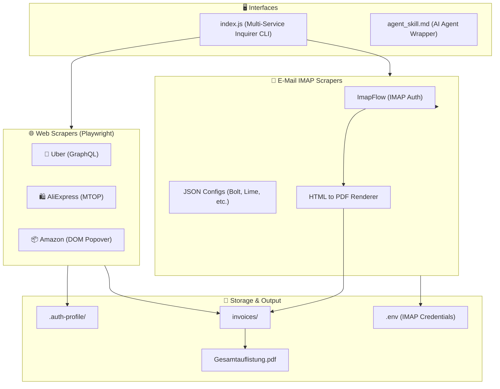

```text
██████╗ ██████╗ ██████╗     ██╗███╗   ██╗██╗   ██╗ ██████╗ ██╗ ██████╗███████╗
██╔══██╗██╔══██╗██╔══██╗    ██║████╗  ██║██║   ██║██╔═══██╗██║██╔════╝██╔════╝
██████╔╝██║  ██║██████╔╝    ██║██╔██╗ ██║██║   ██║██║   ██║██║██║     █████╗  
██╔══██╗██║  ██║██╔══██╗    ██║██║╚██╗██║╚██╗ ██╔╝██║   ██║██║██║     ██╔══╝  
██████╔╝██████╔╝██████╔╝    ██║██║ ╚████║ ╚████╔╝ ╚██████╔╝██║╚██████╗███████╗
╚═════╝ ╚═════╝ ╚═════╝     ╚═╝╚═╝  ╚═══╝  ╚═══╝   ╚═════╝ ╚═╝ ╚═════╝╚══════╝

        A U T O N O M O U S   I N V O I C E   &   R E C E I P T   S U I T E
```

# 🧾 BDB Invoice & Receipt Suite (Multi-Service & IMAP)


[](https://nodejs.org/)
[](#-installation--quick-start)
[](#-supported-services)
[](LICENSE)
[](#-zero-token-accounting-analyzers)

> **Unified, autonomous, cross-platform CLI suite to discover, batch download, and normalize invoices and receipts (Uber, AliExpress, Amazon) and directly from any IMAP E-Mail inbox (Bolt, Adobe, etc.). Generates consolidated accounting tables (`Gesamtauflistung.pdf`).**

---

## 🌟 Key Highlights

### 📧 Universal IMAP E-Mail Scraper
- **🔑 Interactive Auth**: Prompts for `IMAP_HOST`, `IMAP_USER`, and `IMAP_PASS` and securely stores them in a `.env` file.
- **✉️ JSON-driven Provider Configs**: Easily scaffold new email scrapers (like Bolt, Lime, Freenow, Adobe) by typing their name in the CLI. The system automatically creates a `.json` regex config in `services/email/providers/`.
- **✂️ Headless Playwright PDF Rendering**: Dynamically renders HTML emails into clean A4 PDFs with CSS hooks to hide footers/unnecessary clutter.

### 📦 Amazon Invoices
- **🚀 Native Popover Download**: Uses Playwright to navigate Amazon's complex DOM, bypassing standard print dialogs to fetch original Amazon PDF invoices.
- **🔍 Regex Text Extraction**: Parses order numbers, dates, and EUR amounts deterministically.

### 🚖 Uber Invoices
- **⚡ GraphQL Network Interception**: Captures 100% of trips via `https://riders.uber.com/graphql` without virtual scrolling glitches.
- **📅 Chronological Year Tracking**: Resolves Uber's year-omission in relative date strings (`"31. Juli • 9:56"`).
- **📑 Automatic Re-naming**: Extracts official invoice numbers from PDF text: `invoices/Uber-Bv-YYYY-MM-DD-<INVOICE_NO>.pdf`.

### 🛍️ AliExpress Invoices & Receipts
- **🌐 Alibaba MTOP Interceptor**: Intercepts `mtop.aliexpress.buyer.order.list` endpoints for 100% accurate financial metadata.
- **🖼️ Lossless PNG-to-A4 PDF Pipeline**: Automatically captures PNG receipts / Canvas renders and converts them to standardized, accounting-grade A4 PDFs.
- **📊 Consolidated Financial Table**: Generates structured accounting summaries (`Gesamtauflistung.pdf` and `Gesamtauflistung.json`).

### 🛡️ Core Platform
- **🔑 Persistent Chrome Sessions**: Stores logins safely in `.auth-profile/` (no recurring 2FA or Captcha sliders on subsequent runs).
- **💻 100% Cross-Platform**: Runs natively on **macOS**, **Windows (PowerShell / CMD)**, and **Linux**.

---

## 🌐 OpenWiki Living Documentation

- **🚀 Quickstart & Onboarding:** [.openwiki/quickstart.md](.openwiki/quickstart.md)
- **🏗️ Architecture & Signal Flow:** [.openwiki/architecture.md](.openwiki/architecture.md)
- **🏛️ Architecture Decision Records (ADRs):** [.openwiki/decisions.md](.openwiki/decisions.md)
- **📝 Release Notes & Changelog:** [.openwiki/release_notes.md](.openwiki/release_notes.md)

---

## 🔄 Multi-Service Architecture



---

## 🛠️ Installation & Quick Start

### ⚡ Option 1: Run Instantly via NPX (Zero-Install)
```bash
npx -y bdb-dev-uber-recipe-wrapper
```

### 📦 Option 2: Global NPM Installation
```bash
npm install -g invoice-scrape-agent

# Start anytime with:
invoice-scrape-agent
# or
uber-invoice-agent
# or
aliexpress-invoice-agent
```

### 💻 Option 3: Local Git Repository Clone

#### 🍎 macOS / 🐧 Linux
```bash
git clone https://github.com/hybridlabor-api/invoice-scrape-agent.git
cd invoice-scrape-agent
chmod +x install.sh
./install.sh
```

#### 🪟 Windows (PowerShell / CMD)
```powershell
git clone https://github.com/hybridlabor-api/invoice-scrape-agent.git
cd invoice-scrape-agent
powershell -ExecutionPolicy Bypass -File .\install.ps1
```

---

### 🔄 How to Update / Aktualisierung

#### Option A: Local Repository Update
Um die neueste Version von GitHub zu laden und Abhängigkeiten zu aktualisieren:
```bash
npm run update
# oder manuell:
git pull origin main && npm install
```

#### Option B: Global NPM Package Update
```bash
npm install -g invoice-scrape-agent@latest
```

---

## 🎮 Interactive CLI Dashboard

Launch the interactive dashboard:

```bash
npm start
```

```text
======================================================
       🧾 BDB Multi-Service Invoice & Tax Suite 🧾               
======================================================

? Welche Aktion oder welchen Dienst möchtest du wählen?
❯ 🚖 Uber Invoices 
  🛍️ AliExpress Invoices 
  📦 Amazon Invoices 
  ──────────────
  📧 E-Mail Rechnungs-Scraper (IMAP)
  ──────────────
  🌟 Gesamtabrechnung aller Dienste erstellen (Master PDF)
  🤖 Neuen Web-Scraper generieren (Dojo AI)
  📁 Rechnungsordner öffnen (invoices/)
  ──────────────
  🚪 Beenden
```

---

## 📄 License & Attribution

Distributed under the **MIT License**. Part of the BDB Developer Toolchain.
