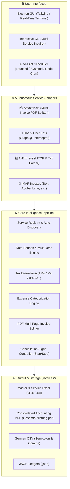

```text
        ██████╗ ██████╗ ██████╗     ██╗███╗   ██╗██╗   ██╗ ██████╗ ██╗ ██████╗███████╗
        ██╔══██╗██╔══██╗██╔══██╗    ██║████╗  ██║██║   ██║██╔═══██╗██║██╔════╝██╔════╝
        ██████╔╝██║  ██║██████╔╝    ██║██╔██╗ ██║██║   ██║██║   ██║██║██║     █████╗  
        ██╔══██╗██║  ██║██╔══██╗    ██║██║╚██╗██║╚██╗ ██╔╝██║   ██║██║██║     ██╔══╝  
        ██████╔╝██████╔╝██████╔╝    ██║██║ ╚████║ ╚████╔╝ ╚██████╔╝██║╚██████╗███████╗
        ╚═════╝ ╚═════╝ ╚═════╝     ╚═╝╚═╝  ╚═══╝  ╚═══╝   ╚═════╝ ╚═╝ ╚═════╝╚══════╝

            A U T O N O M O U S   I N V O I C E   &   R E C E I P T   S U I T E
```

# 🧾 BDB Invoice & Receipt Suite (Multi-Service & IMAP)

[](https://npmjs.org/package/invoice-scrape-agent)
[](https://nodejs.org/)
[](#-installation--quick-start)
[](#-supported-services)
[](tests/)
[](LICENSE)

> **Unified, autonomous, cross-platform CLI & GUI suite to discover, batch download, split composite invoices, normalize accounting data, and export tax-compliant Excel (`.xlsx`, `.xls`), PDF, and CSV ledgers across Amazon, Uber, AliExpress, and IMAP inboxes.**

---

## 🌟 9-Step Feature Architecture & Core Capabilities

The suite implements a complete, enterprise-grade invoice acquisition and financial processing engine:



---

### 1. 🔄 Multi-Service Selection & Registry Auto-Discovery
* **Checkbox & Batch Runs**: Select individual services, multiple combined services (`amazon, uber, aliexpress`), or run `ALL` simultaneously.
* **Pluggable Architecture**: `ServiceRegistry` dynamically discovers and registers newly scaffolded services from `services/` at runtime without restarting.

### 2. 📅 Native Excel Date Formatting (`YYYY-MM-DD`)
* **True Date Cells**: Dates in `.xlsx` and `.xls` spreadsheets are encoded as native date cells (`t: 'd'`), avoiding text-formatting glitches in Excel, Numbers, and Google Sheets.
* **Two-Column Date Integrity**: Distinguishes **Steuerdatum** (tax/order date) and **Rechnungsdatum** (invoice issuance date) for tax audit compliance.

### 3. 📑 Sortable Master Tables & Dedicated Service Tabs
* **AutoFilter Enabled**: Interactive dropdown filters on table headers in all sheets.
* **Multi-Tab Organization**: Generates dedicated worksheets per service (`Amazon.de`, `Uber`, `AliExpress`) plus consolidated overview sheets (`Alle Belege`, `Monatsübersicht`, `Kategorien`, `Dienste`).
* **Dynamic Formulas**: Dynamic Excel `=SUM(...)` formulas with embedded calculated cache values for instant totals in Google Sheets and LibreOffice.

### 4. 🛍️ AliExpress Belege & Tax Parsing
* **Automatic Tax Breakdown**: Accurately computes net amounts and 19% VAT from gross totals via `calculateTaxBreakdown()`.
* **Currency Normalization**: Deterministically parses European and international currency strings (`€ 45,50`, `45.50 EUR`, `$30.00`).
* **Canvas / Receipt to A4 PDF**: Lossless capture of PNG receipts and Canvas renders converted to clean A4 PDFs.

### 5. 🛑 Start / Stopp Button & Asynchronous Cancellation
* **Real-time Abort**: Dedicated Stop button in GUI and `SIGINT` handling in CLI sets `isCancelled = true`.
* **Graceful Termination**: Asynchronous loops terminate immediately, killing child processes and releasing Playwright browser contexts without data corruption.

### 6. 📆 Multi-Year & Date Range Filtering
* **Flexible Input Parsing**: Accepts single years (`2025`), year ranges (`2023-2025`, `2024..2026`), comma-separated lists (`2024, 2026`), and exact date ranges (`2025-01-01` to `2025-12-31`).
* **Early-Exit Scraping**: Automatically stops scraping further pages as soon as orders exceed the requested date boundaries.

### 7. 🚖 Uber Quittungen vs. Rechnungen & Tax Split
* **GraphQL Network Interception**: Captures 100% of trips without virtual scrolling omissions.
* **Tax Distinction**:
  * **Uber Fahrten**: Standard 19% VAT categorized as **Reise**.
  * **Uber Eats**: Reduced 7% VAT categorized as **Kost & Logis**.
* **Automatic Invoice Renaming**: Extracts official invoice numbers: `invoices/Uber-Bv-YYYY-MM-DD-<INVOICE_NO>.pdf`.

### 8. ✂️ Amazon Multi-Invoice PDF Splitting
* **Atomic Single-Invoice PDFs**: Automatically detects multi-part composite PDF invoices (e.g. "Seite 1 von 2" containing 2 distinct invoice numbers) and splits them into clean individual PDF files with matching invoice numbers and gross amounts.

### 9. 🏷️ Expense Categorization & Master Dashboard
* **Automatic Category Assignment**:
  * 💻 **Anschaffung**: Hardware, electronics, single purchases $\ge$ 150 €
  * 📦 **Verbrauchsmaterial**: Minor supplies, cables, items $<$ 80 €
  * 🍽️ **Kost & Logis**: Restaurants, food delivery, hotels, travel accommodation
  * 🚆 **Reise**: Train tickets, taxi rides, flights, fuel
  * 📋 **Sonstiges**: General operating expenses
* **Dedicated Summary Sheet**: The `Kategorien` worksheet calculates invoice counts, net sums, VAT, and gross totals per expense category with automated SUM formulas.

---

## 🖥️ Electron GUI & Real-time Debugging

* **Glassmorphism UI**: High-contrast, dark-mode native interface with Tailwind CSS.
* **Real-time Terminal Stream**: Direct stdout/stderr log broadcast via IPC channel `backend-log`.
* **Auto-Pilot Scheduler**: One-click background cron configuration with customizable interval (24h, 12h, 1h).
* **Modal Controls**: Year ranges, date boundaries, IMAP credentials, and custom service scaffolding wizards.

---

## 📁 Storage Structure & Generated Files

All downloaded and generated files are stored in the persistent `invoices/` directory:

```text
invoices/
├── Gesamtauflistung_Master.pdf      # Consolidated Master PDF summary
├── master_ledger.xlsx              # Multi-tab Excel spreadsheet (with Categories & AutoFilter)
├── master_ledger.xls               # Classic BIFF8 binary spreadsheet
├── master_ledger.csv               # German semicolon-delimited CSV
├── master_ledger.html              # Clean HTML report
├── master_ledger.json              # Aggregated machine-readable database
│
├── amazon/                         # Amazon downloaded & split PDFs + ledger
│   ├── Amazon-2025-11-28-DS-AEU-INV-DE-2025-598381416.pdf
│   ├── Amazon-2025-11-28-DS-AEU-INV-DE-2025-598381454.pdf
│   ├── amazon_ledger.json
│   └── Gesamtauflistung.pdf
│
├── uber/                           # Uber & Uber Eats PDFs + ledger
│   ├── Uber-Bv-2025-11-28-FGAACEGJ-03-2025-1988461.pdf
│   ├── uber_ledger.json
│   └── Gesamtauflistung.pdf
│
└── aliexpress/                     # AliExpress A4 converted PDFs + ledger
    ├── AliExpress-2025-05-10-3048397662.pdf
    ├── aliexpress_ledger.json
    └── Gesamtauflistung.pdf
```

---

## 🛠️ Installation & Quick Start

### 1. Global Installation (Recommended)
```bash
npm install -g invoice-scrape-agent
```

*The installer automatically creates functional Desktop Shortcuts for both the GUI and CLI on macOS and Windows.*

### 2. Launching

**Start Electron GUI:**
```bash
invoice-scrape-agent-gui
```

**Start Interactive CLI:**
```bash
invoice-scrape-agent
```

### 3. Local Development & Testing

```bash
# Clone repository
git clone https://github.com/hybridlabor-api/invoice-scrape-agent.git
cd invoice-scrape-agent
npm install

# Run complete 36-test suite (9 Steps + GUI Pipeline)
npm test

# Generate Master Reports manually
node -e "const MasterAnalyzer = require('./services/unified/master-analyzer'); new MasterAnalyzer().generateMasterPdf();"
```

---

## 🧪 Automated Test Suite

The project includes an end-to-end automated testing suite with 36 tests across 10 suites:

* [`tests/e2e/all_9_steps.test.js`](file:///Users/timrennings/invoice-scrape-agent/tests/e2e/all_9_steps.test.js): End-to-end verification of all 9 business steps.
* [`tests/gui/electron_gui.test.js`](file:///Users/timrennings/invoice-scrape-agent/tests/gui/electron_gui.test.js): Electron DOM, IPC bridge contract, and log broadcasting pipeline.
* [`tests/services/amazon.test.js`](file:///Users/timrennings/invoice-scrape-agent/tests/services/amazon.test.js): Amazon scraping and PDF splitting tests.
* [`tests/services/base.test.js`](file:///Users/timrennings/invoice-scrape-agent/tests/services/base.test.js): BaseService cancellation and currency normalization.
* [`tests/services/excel.test.js`](file:///Users/timrennings/invoice-scrape-agent/tests/services/excel.test.js): Date cell formatting and Excel generation tests.

---

## 📄 License & Attribution

Distributed under the **MIT License**. Part of the BDB Developer Toolchain.
