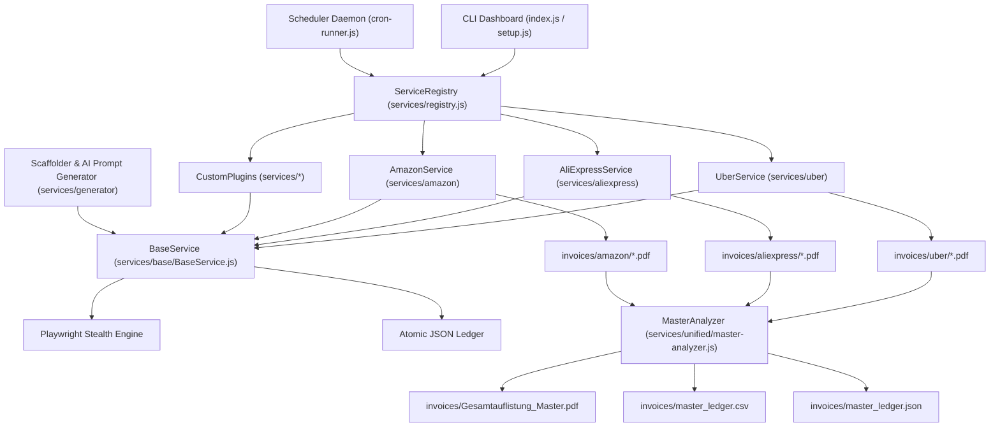

# Amazon Integration & Pluggable Multi-Service Scraper Engine Implementation Plan

> **For Claude:** REQUIRED SUB-SKILL: Use superpowers:executing-plans to implement this plan task-by-task.

**Goal:** Transform `invoice-scrape-agent` into an extensible, pluggable multi-service invoice scraper platform featuring an enterprise-grade `BaseService` abstraction, automated AI-agent scaffolder for new scraping targets, full Amazon (amazon.de/amazon.com) invoice downloading & analysis engine, autonomous cron scheduler daemon, and a unified cross-platform multi-service master accounting ledger & tax PDF generator.

**Architecture:** A plugin-driven architecture where every service scraper (Uber, AliExpress, Amazon, and user-generated targets) extends a common `BaseService` interface registered via `ServiceRegistry`. The engine separates browser automation & session persistence (Playwright stealth with persistent contexts), ledger state tracking (JSON atomic ledgers for deduplication and incremental sync), invoice parsing (`pdf-parse` with heuristics), and report rendering (`pdfkit` table generators). A central `MasterAnalyzer` aggregates data streams into a unified fiscal overview, while `cron-runner` enables headless scheduled runs with desktop/log notifications.

**Tech Stack:** Node.js (v20+), Playwright (Stealth & Persistent Profile Contexts), PDFKit, pdf-parse, Inquirer (v9), Node.js native test runner (`node:test` & `node:assert`), Dotenv.

---

## Architectural Signal Flow & System Topology



---

## Core Data Schema Contracts

### Standard Normalized Invoice Record (`UnifiedInvoiceRecord`)
```typescript
interface UnifiedInvoiceRecord {
  id: string;                  // Unique hash or Order/Invoice ID (e.g. "AMZ-305-1234567-8901234")
  service: string;             // Service identifier (e.g. "amazon", "uber", "aliexpress")
  serviceDisplayName: string;  // Human readable name (e.g. "Amazon.de", "Uber Rides")
  orderId: string;             // Order number or ride ID
  invoiceNumber: string;       // Formal tax invoice number or fallback order ID
  date: string;                // ISO 8601 date format "YYYY-MM-DD"
  netto: number;               // Net amount in currency (e.g. 84.03)
  ust: number;                 // VAT / Tax amount (e.g. 15.97)
  brutto: number;              // Total gross amount (e.g. 100.00)
  taxRate: string;             // Tax percentage string (e.g. "19%", "7%", "0%")
  currency: string;            // ISO currency code (e.g. "EUR", "USD")
  category: string;            // Accounting category ("Office", "Travel", "Hardware", etc.)
  seller: string;              // Merchant / Seller name (e.g. "Amazon EU S.a.r.l.", "Uber B.V.")
  items: Array<{               // Line items (if available)
    name: string;
    quantity: number;
    price: number;
  }>;
  pdfPath: string;             // Absolute or relative path to normalized invoice PDF
  sourceUrl?: string;          // Direct URL to original order / invoice
  status: "downloaded" | "parsed" | "error";
  metadata?: Record<string, any>;
}
```

---

## Task Breakdown

### Task 1: Base Service Interface & Central Service Registry

**Files:**
- Create: `services/base/BaseService.js`
- Create: `services/registry.js`
- Create: `tests/services/base.test.js`
- Create: `tests/services/registry.test.js`

**Context & Requirements:**
Every scraper needs unified hooks for:
1. Browser initialization (stealth flags, persistent cookies/profile per service).
2. Atomic JSON ledger reading/writing (prevent re-downloading existing orders).
3. Lifecycle methods: `authenticate()`, `scan()`, `fetch()`, `analyze()`.
4. Currency and date normalization utilities.
`ServiceRegistry` dynamically discovers existing and newly scaffolded services under `services/` and provides a unified factory API.

#### Step 1: Write the failing test for BaseService and ServiceRegistry

`tests/services/base.test.js`:
```javascript
const { test, describe, beforeEach, afterEach } = require('node:test');
const assert = require('node:assert/strict');
const fs = require('fs');
const path = require('path');
const BaseService = require('../../services/base/BaseService');

describe('BaseService Interface & Utilities', () => {
  const testDir = path.join(__dirname, '../fixtures/test_service_data');
  
  class MockService extends BaseService {
    constructor() {
      super({
        id: 'mock_service',
        displayName: 'Mock Service Inc.',
        icon: '🧪',
        authUrl: 'https://example.com/login',
        baseDir: testDir
      });
    }

    async authenticate() { return { success: true }; }
    async scan() { return [{ orderId: 'MOCK-1', date: '2026-01-01', brutto: 50 }]; }
    async fetch() { return { downloaded: 1, skipped: 0 }; }
    async analyze() { return { totalNetto: 42.02, totalUst: 7.98, totalBrutto: 50.00 }; }
  }

  beforeEach(() => {
    if (!fs.existsSync(testDir)) fs.mkdirSync(testDir, { recursive: true });
  });

  afterEach(() => {
    if (fs.existsSync(testDir)) fs.rmSync(testDir, { recursive: true, force: true });
  });

  test('should initialize service metadata and paths correctly', () => {
    const service = new MockService();
    assert.equal(service.id, 'mock_service');
    assert.equal(service.displayName, 'Mock Service Inc.');
    assert.equal(service.icon, '🧪');
    assert.ok(service.invoicesDir.includes('mock_service'));
    assert.ok(service.ledgerFile.includes('mock_service_ledger.json'));
  });

  test('should manage atomic ledger read, write, and duplicate checks', () => {
    const service = new MockService();
    assert.deepEqual(service.loadLedger(), []);

    const record = {
      id: 'MOCK-100',
      orderId: 'MOCK-100',
      date: '2026-05-10',
      brutto: 119.00,
      netto: 100.00,
      ust: 19.00,
      pdfPath: 'invoices/mock_service/2026-05-10_MOCK-100.pdf'
    };

    service.saveLedgerRecord(record);
    const ledger = service.loadLedger();
    assert.equal(ledger.length, 1);
    assert.equal(ledger[0].id, 'MOCK-100');
    assert.equal(service.isAlreadyDownloaded('MOCK-100'), true);
    assert.equal(service.isAlreadyDownloaded('MOCK-999'), false);
  });

  test('should normalize various date formats to YYYY-MM-DD', () => {
    const service = new MockService();
    assert.equal(service.normalizeDate('2026-08-07'), '2026-08-07');
    assert.equal(service.normalizeDate('07.08.2026'), '2026-08-07');
    assert.equal(service.normalizeDate('Aug 7, 2026'), '2026-08-07');
    assert.equal(service.normalizeDate('7. August 2026'), '2026-08-07');
  });

  test('should parse European and US currency formats accurately', () => {
    const service = new MockService();
    assert.equal(service.parseCurrency('1.234,56 €'), 1234.56);
    assert.equal(service.parseCurrency('$1,234.56'), 1234.56);
    assert.equal(service.parseCurrency('24,99 EUR'), 24.99);
    assert.equal(service.parseCurrency('19.99'), 19.99);
  });
});
```

`tests/services/registry.test.js`:
```javascript
const { test, describe } = require('node:test');
const assert = require('node:assert/strict');
const ServiceRegistry = require('../../services/registry');
const BaseService = require('../../services/base/BaseService');

describe('ServiceRegistry', () => {
  test('should register and retrieve services', () => {
    class DummyService extends BaseService {
      constructor() {
        super({ id: 'dummy', displayName: 'Dummy Service', icon: '📦' });
      }
    }

    ServiceRegistry.register('dummy', DummyService);
    assert.ok(ServiceRegistry.has('dummy'));

    const serviceInstance = ServiceRegistry.get('dummy');
    assert.equal(serviceInstance.id, 'dummy');
    assert.equal(serviceInstance.displayName, 'Dummy Service');
  });

  test('should list all registered services with metadata', () => {
    const list = ServiceRegistry.list();
    assert.ok(Array.isArray(list));
    const found = list.find(s => s.id === 'dummy');
    assert.ok(found);
    assert.equal(found.displayName, 'Dummy Service');
  });
});
```

#### Step 2: Run test to verify it fails

```bash
node --test tests/services/base.test.js tests/services/registry.test.js
```
Expected: FAIL (`Cannot find module '../../services/base/BaseService'`)

#### Step 3: Implement BaseService & ServiceRegistry

`services/base/BaseService.js`:
```javascript
const fs = require('fs');
const path = require('path');
const { chromium } = require('playwright');

const MONTH_MAP = {
  'jan': 0, 'feb': 1, 'mar': 2, 'mär': 2, 'apr': 3, 'may': 4, 'mai': 4,
  'jun': 5, 'jul': 6, 'aug': 7, 'sep': 8, 'oct': 9, 'okt': 9, 'nov': 10, 'dec': 11, 'dez': 11
};

class BaseService {
  /**
   * @param {Object} config
   * @param {string} config.id - Service unique ID (e.g. 'amazon', 'uber')
   * @param {string} config.displayName - Display name (e.g. 'Amazon.de')
   * @param {string} config.icon - Emoji icon (e.g. '📦')
   * @param {string} [config.authUrl] - Direct login URL
   * @param {string} [config.baseDir] - Project root directory override
   */
  constructor({ id, displayName, icon, authUrl = '', baseDir = null }) {
    if (!id) throw new Error('BaseService requires a valid "id"');
    this.id = id;
    this.displayName = displayName || id;
    this.icon = icon || '🧾';
    this.authUrl = authUrl;

    const root = baseDir || path.resolve(__dirname, '../../');
    this.invoicesDir = path.join(root, 'invoices', this.id);
    this.profileDir = path.join(root, '.auth-profile', this.id);
    this.ledgerFile = path.join(this.invoicesDir, `${this.id}_ledger.json`);

    this.ensureDirectories();
  }

  ensureDirectories() {
    if (!fs.existsSync(this.invoicesDir)) fs.mkdirSync(this.invoicesDir, { recursive: true });
    if (!fs.existsSync(this.profileDir)) fs.mkdirSync(this.profileDir, { recursive: true });
  }

  /**
   * Load JSON ledger for this service.
   * @returns {Array<Object>}
   */
  loadLedger() {
    try {
      if (fs.existsSync(this.ledgerFile)) {
        const raw = fs.readFileSync(this.ledgerFile, 'utf8');
        return JSON.parse(raw);
      }
    } catch (e) {
      console.warn(`[${this.id}] Warning loading ledger:`, e.message);
    }
    return [];
  }

  /**
   * Save full ledger atomically.
   * @param {Array<Object>} ledger
   */
  saveLedger(ledger) {
    this.ensureDirectories();
    const tempFile = `${this.ledgerFile}.tmp`;
    fs.writeFileSync(tempFile, JSON.stringify(ledger, null, 2), 'utf8');
    fs.renameSync(tempFile, this.ledgerFile);
  }

  /**
   * Add or update an invoice record in the ledger.
   * @param {Object} record
   */
  saveLedgerRecord(record) {
    const ledger = this.loadLedger();
    const recordId = record.id || record.orderId || record.invoiceNumber;
    const idx = ledger.findIndex(item => (item.id || item.orderId || item.invoiceNumber) === recordId);

    const completeRecord = {
      service: this.id,
      serviceDisplayName: this.displayName,
      updatedAt: new Date().toISOString(),
      ...record
    };

    if (idx >= 0) {
      ledger[idx] = { ...ledger[idx], ...completeRecord };
    } else {
      ledger.push(completeRecord);
    }
    this.saveLedger(ledger);
  }

  /**
   * Check if invoice/order is already saved.
   * @param {string} orderId
   * @returns {boolean}
   */
  isAlreadyDownloaded(orderId) {
    if (!orderId) return false;
    const ledger = this.loadLedger();
    return ledger.some(item => (item.id === orderId || item.orderId === orderId) && item.pdfPath && fs.existsSync(path.resolve(this.invoicesDir, '..', '..', item.pdfPath)));
  }

  /**
   * Normalize arbitrary date strings into YYYY-MM-DD.
   * @param {string|number|Date} rawDate
   * @returns {string}
   */
  normalizeDate(rawDate) {
    if (!rawDate) return new Date().toISOString().slice(0, 10);

    if (rawDate instanceof Date && !isNaN(rawDate.getTime())) {
      return rawDate.toISOString().slice(0, 10);
    }

    if (typeof rawDate === 'number' || /^\d{10,13}$/.test(String(rawDate).trim())) {
      const num = Number(rawDate);
      const ts = num < 10000000000 ? num * 1000 : num;
      const d = new Date(ts);
      if (!isNaN(d.getTime())) return d.toISOString().slice(0, 10);
    }

    const str = String(rawDate).trim();
    if (/^\d{4}-\d{2}-\d{2}/.test(str)) return str.slice(0, 10);
    if (/^\d{4}\.\d{2}\.\d{2}/.test(str)) return str.slice(0, 10).replace(/\./g, '-');

    // German format: DD.MM.YYYY
    const dmy = str.match(/^(\d{1,2})\.(\d{1,2})\.(\d{4})/);
    if (dmy) {
      return `${dmy[3]}-${dmy[2].padStart(2, '0')}-${dmy[1].padStart(2, '0')}`;
    }

    // English format: "Month DD, YYYY" or "DD. Month YYYY"
    const m1 = str.match(/([A-Za-zäöüÄÖÜ]{3,})\.?\s+(\d{1,2}),?\s+(\d{4})/);
    if (m1) {
      const mStr = m1[1].toLowerCase().slice(0, 3);
      const mIdx = MONTH_MAP[mStr] !== undefined ? MONTH_MAP[mStr] : 0;
      return `${m1[3]}-${String(mIdx + 1).padStart(2, '0')}-${m1[2].padStart(2, '0')}`;
    }

    const m2 = str.match(/(\d{1,2})\.?\s*([A-Za-zäöüÄÖÜ]{3,})\.?\s+(\d{4})/);
    if (m2) {
      const mStr = m2[2].toLowerCase().slice(0, 3);
      const mIdx = MONTH_MAP[mStr] !== undefined ? MONTH_MAP[mStr] : 0;
      return `${m2[3]}-${String(mIdx + 1).padStart(2, '0')}-${m2[1].padStart(2, '0')}`;
    }

    const parsed = new Date(str);
    if (!isNaN(parsed.getTime())) return parsed.toISOString().slice(0, 10);

    return new Date().toISOString().slice(0, 10);
  }

  /**
   * Parse localized currency string into a float number.
   * @param {string|number} rawAmount
   * @returns {number}
   */
  parseCurrency(rawAmount) {
    if (typeof rawAmount === 'number') return rawAmount;
    if (!rawAmount) return 0;
    const str = String(rawAmount).replace(/[^0-9.,-]/g, '').trim();
    if (!str) return 0;

    // Detect format: 1.234,56 vs 1,234.56 vs 24.99 vs 24,99
    if (str.includes(',') && str.includes('.')) {
      if (str.lastIndexOf(',') > str.lastIndexOf('.')) {
        // European: 1.234,56 -> 1234.56
        return parseFloat(str.replace(/\./g, '').replace(',', '.')) || 0;
      } else {
        // US: 1,234.56 -> 1234.56
        return parseFloat(str.replace(/,/g, '')) || 0;
      }
    } else if (str.includes(',')) {
      // European decimal comma: 24,99 -> 24.99
      return parseFloat(str.replace(',', '.')) || 0;
    }
    return parseFloat(str) || 0;
  }

  /**
   * Launch stealth browser with persistent authentication context.
   * @param {Object} [options]
   * @param {boolean} [options.headless=false]
   * @param {number} [options.slowMo=0]
   * @returns {Promise<import('playwright').BrowserContext>}
   */
  async launchBrowser({ headless = false, slowMo = 0 } = {}) {
    this.ensureDirectories();
    const args = [
      '--disable-blink-features=AutomationControlled',
      '--no-sandbox',
      '--disable-setuid-sandbox',
      '--disable-infobars',
      '--window-position=0,0',
      '--ignore-certificate-errors',
      '--ignore-certificate-errors-spki-list'
    ];

    let context;
    try {
      context = await chromium.launchPersistentContext(this.profileDir, {
        headless,
        slowMo,
        channel: 'chrome',
        viewport: { width: 1440, height: 900 },
        acceptDownloads: true,
        args,
        ignoreDefaultArgs: ['--enable-automation']
      });
    } catch (e) {
      context = await chromium.launchPersistentContext(this.profileDir, {
        headless,
        slowMo,
        viewport: { width: 1440, height: 900 },
        acceptDownloads: true,
        args
      });
    }

    // Bypass navigator.webdriver detection
    const page = context.pages().length > 0 ? context.pages()[0] : await context.newPage();
    await page.addInitScript(() => {
      Object.defineProperty(navigator, 'webdriver', { get: () => undefined });
    });

    return context;
  }

  /* Abstract lifecycle methods to be overridden by subclasses */
  async authenticate(options = {}) { throw new Error(`${this.displayName} must implement authenticate()`); }
  async scan(options = {}) { throw new Error(`${this.displayName} must implement scan()`); }
  async fetch(options = {}) { throw new Error(`${this.displayName} must implement fetch()`); }
  async analyze(options = {}) { throw new Error(`${this.displayName} must implement analyze()`); }
}

module.exports = BaseService;
```

`services/registry.js`:
```javascript
const fs = require('fs');
const path = require('path');

class ServiceRegistry {
  constructor() {
    this.services = new Map();
  }

  /**
   * Register a service class.
   * @param {string} id
   * @param {typeof import('./base/BaseService')} ServiceClass
   */
  register(id, ServiceClass) {
    this.services.set(id, ServiceClass);
  }

  /**
   * Check if service exists.
   * @param {string} id
   * @returns {boolean}
   */
  has(id) {
    return this.services.has(id);
  }

  /**
   * Get an instantiated service instance.
   * @param {string} id
   * @param {Object} [config]
   * @returns {import('./base/BaseService')}
   */
  get(id, config = {}) {
    const ServiceClass = this.services.get(id);
    if (!ServiceClass) {
      throw new Error(`Service '${id}' is not registered in ServiceRegistry.`);
    }
    return new ServiceClass(config);
  }

  /**
   * Get list of all registered service descriptors.
   * @returns {Array<{ id: string, displayName: string, icon: string, authUrl: string }>}
   */
  list() {
    const result = [];
    for (const [id, ServiceClass] of this.services.entries()) {
      try {
        const instance = new ServiceClass();
        result.push({
          id: instance.id,
          displayName: instance.displayName,
          icon: instance.icon,
          authUrl: instance.authUrl
        });
      } catch (e) {
        result.push({ id, displayName: id, icon: '📦', authUrl: '' });
      }
    }
    return result;
  }

  /**
   * Auto-discover installed service packages under services/*
   */
  autoDiscover(servicesDir = __dirname) {
    const entries = fs.readdirSync(servicesDir, { withFileTypes: true });
    for (const entry of entries) {
      if (entry.isDirectory() && !['base', 'generator', 'unified', 'scheduler'].includes(entry.name)) {
        const indexPath = path.join(servicesDir, entry.name, 'index.js');
        const servicePath = path.join(servicesDir, entry.name, `${entry.name}.service.js`);
        
        let loadedModule = null;
        if (fs.existsSync(indexPath)) {
          loadedModule = require(indexPath);
        } else if (fs.existsSync(servicePath)) {
          loadedModule = require(servicePath);
        }

        if (loadedModule && typeof loadedModule === 'function') {
          this.register(entry.name, loadedModule);
        } else if (loadedModule && loadedModule.Service) {
          this.register(entry.name, loadedModule.Service);
        }
      }
    }
  }
}

const instance = new ServiceRegistry();
module.exports = instance;
```

#### Step 4: Run tests to verify they pass

```bash
node --test tests/services/base.test.js tests/services/registry.test.js
```
Expected: PASS (All tests passing)

#### Step 5: Commit

```bash
git add services/base/BaseService.js services/registry.js tests/services/base.test.js tests/services/registry.test.js
git commit -m "feat(core): implement BaseService interface and central ServiceRegistry"
```

---

### Task 2: Service Scaffolder & AI Agent Prompt Generator

**Files:**
- Create: `services/generator/scaffold.js`
- Create: `services/generator/templates/ServiceTemplate.js`
- Create: `services/generator/templates/agent_prompt.md`
- Create: `tests/services/generator.test.js`

**Context & Requirements:**
To enable zero-friction expansion to hundreds of online stores (Miro, Adobe, Apple, Digitec, MediaMarkt, etc.), we provide:
1. `services/generator/scaffold.js`: CLI tool creating the folder boilerplate (`auth.js`, `fetcher.js`, `analyzer.js`, `index.js`, `tests/`).
2. `services/generator/templates/agent_prompt.md`: Structured AI prompt specifically instructing Antigravity, Claude Code, or Codex to analyze DOM / network traces of the target store and populate the scraper hooks according to `BaseService`.

#### Step 1: Write the failing test for Generator Scaffolder

`tests/services/generator.test.js`:
```javascript
const { test, describe, afterEach } = require('node:test');
const assert = require('node:assert/strict');
const fs = require('fs');
const path = require('path');
const { scaffoldService } = require('../../services/generator/scaffold');

describe('Service Scaffolder', () => {
  const targetDir = path.join(__dirname, '../../services/testvendor');
  const testDir = path.join(__dirname, '../services/testvendor.test.js');

  afterEach(() => {
    if (fs.existsSync(targetDir)) fs.rmSync(targetDir, { recursive: true, force: true });
    if (fs.existsSync(testDir)) fs.rmSync(testDir, { force: true });
  });

  test('should scaffold all required service files and prompt artifact', () => {
    const result = scaffoldService({
      name: 'testvendor',
      displayName: 'Test Vendor Store',
      icon: '🛒',
      authUrl: 'https://testvendor.com/login'
    });

    assert.equal(result.success, true);
    assert.ok(fs.existsSync(path.join(targetDir, 'index.js')));
    assert.ok(fs.existsSync(path.join(targetDir, 'auth.js')));
    assert.ok(fs.existsSync(path.join(targetDir, 'fetcher.js')));
    assert.ok(fs.existsSync(path.join(targetDir, 'analyzer.js')));
    assert.ok(fs.existsSync(path.join(targetDir, 'AGENT_PROMPT.md')));
  });
});
```

#### Step 2: Run test to verify it fails

```bash
node --test tests/services/generator.test.js
```
Expected: FAIL (`Cannot find module '../../services/generator/scaffold'`)

#### Step 3: Implement Generator & Templates

`services/generator/templates/ServiceTemplate.js`:
```javascript
const BaseService = require('../base/BaseService');
const path = require('path');
const fs = require('fs');
const pdf = require('pdf-parse');

class __SERVICE_CLASS__ extends BaseService {
  constructor(config = {}) {
    super({
      id: '__SERVICE_ID__',
      displayName: '__DISPLAY_NAME__',
      icon: '__ICON__',
      authUrl: '__AUTH_URL__',
      ...config
    });
  }

  /**
   * Step 1: Interactive Browser Authentication & Session Capturing
   */
  async authenticate({ headless = false } = {}) {
    console.log(`\n🔐 [${this.displayName}] Opening browser for authentication...`);
    const context = await this.launchBrowser({ headless });
    const page = context.pages()[0] || await context.newPage();

    try {
      await page.goto(this.authUrl, { waitUntil: 'domcontentloaded' });
      console.log(`👉 Please complete login in the browser window. Waiting for session...`);
      
      // Wait for authenticated indicator (Customize selector for this service)
      await page.waitForFunction(() => {
        return !window.location.href.includes('/login') && !window.location.href.includes('/signin');
      }, { timeout: 0 });

      console.log(`✅ [${this.displayName}] Authentication successful! Profile cached.`);
      return { success: true };
    } catch (e) {
      console.error(`❌ [${this.displayName}] Authentication failed:`, e.message);
      return { success: false, error: e.message };
    } finally {
      await context.close();
    }
  }

  /**
   * Step 2: Scan orders / invoices without downloading
   */
  async scan({ year = null, startDate = null, endDate = null } = {}) {
    console.log(`\n🔍 [${this.displayName}] Scanning orders...`);
    const context = await this.launchBrowser({ headless: true });
    const page = context.pages()[0] || await context.newPage();
    const orders = [];

    try {
      // TODO: Implement order listing pagination and DOM/API scraping
      return orders;
    } finally {
      await context.close();
    }
  }

  /**
   * Step 3: Fetch & Normalize PDF Invoices
   */
  async fetch({ all = false, year = null, startDate = null, endDate = null, limit = null, headless = true } = {}) {
    console.log(`\n⬇️ [${this.displayName}] Fetching invoices...`);
    const context = await this.launchBrowser({ headless });
    const page = context.pages()[0] || await context.newPage();
    let downloadedCount = 0;

    try {
      // TODO: Loop through orders, verify ledger duplicate, download or generate PDF
      return { downloaded: downloadedCount };
    } finally {
      await context.close();
    }
  }

  /**
   * Step 4: Parse & Generate Service Summary PDF
   */
  async analyze() {
    const files = fs.readdirSync(this.invoicesDir).filter(f => f.endsWith('.pdf') && !f.startsWith('Gesamtauflistung'));
    console.log(`\n📊 [${this.displayName}] Analyzing ${files.length} invoice PDFs...`);
    
    // Parse invoices and aggregate totals
    const ledger = this.loadLedger();
    const totalBrutto = ledger.reduce((sum, item) => sum + (item.brutto || 0), 0);
    const totalNetto = ledger.reduce((sum, item) => sum + (item.netto || 0), 0);
    const totalUst = ledger.reduce((sum, item) => sum + (item.ust || 0), 0);

    return { count: files.length, totalBrutto, totalNetto, totalUst };
  }
}

module.exports = __SERVICE_CLASS__;
```

`services/generator/templates/agent_prompt.md`:
```markdown
# AI Agent Instruction: Scrape Service Implementation for `__DISPLAY_NAME__`

You are an expert browser automation and reverse-engineering AI agent implementing the `__DISPLAY_NAME__` invoice scraper plugin for `invoice-scrape-agent`.

## Architecture & Contract
You must implement `services/__SERVICE_ID__/index.js` subclassing `BaseService` (`services/base/BaseService.js`).

### Target Specifications:
- **Service ID:** `__SERVICE_ID__`
- **Display Name:** `__DISPLAY_NAME__`
- **Icon:** `__ICON__`
- **Login URL:** `__AUTH_URL__`

## Implementation Steps
1. **Authentication (`authenticate`)**:
   - Navigate to `__AUTH_URL__`.
   - Monitor navigation until a logged-in cookie or authenticated DOM element is detected.
   - Profile state is automatically saved into `.auth-profile/__SERVICE_ID__`.

2. **Order Scanning (`scan`)**:
   - Find the orders list page.
   - Extract `orderId`, `date`, `totalAmount`, `status`, and `invoiceDownloadUrl`.
   - Support filtering by `year` or `startDate`/`endDate`.

3. **Invoice Fetching (`fetch`)**:
   - Check `this.isAlreadyDownloaded(orderId)` to skip existing invoices.
   - If direct PDF download link exists, download to `invoices/__SERVICE_ID__/YYYY-MM-DD_Order_<orderId>.pdf`.
   - If invoice is HTML, use Playwright `page.pdf({ format: 'A4', printBackground: true })`.
   - Record entry via `this.saveLedgerRecord(record)`.

4. **Accounting Analyzer (`analyze`)**:
   - Read PDFs via `pdf-parse` or extract directly from the JSON ledger.
   - Extract Netto, USt (VAT), Brutto, Seller Name, Tax Rate.
   - Generate `invoices/__SERVICE_ID__/Gesamtauflistung___SERVICE_ID__.pdf` with PDFKit.
```

`services/generator/scaffold.js`:
```javascript
const fs = require('fs');
const path = require('path');

function scaffoldService({ name, displayName, icon = '📦', authUrl = '' }) {
  if (!name) throw new Error('Service name is required');
  const serviceId = name.toLowerCase().replace(/[^a-z0-9_-]/g, '');
  const className = serviceId.charAt(0).toUpperCase() + serviceId.slice(1) + 'Service';
  const serviceDir = path.resolve(__dirname, '..', serviceId);

  if (fs.existsSync(serviceDir)) {
    return { success: false, error: `Directory ${serviceDir} already exists.` };
  }

  fs.mkdirSync(serviceDir, { recursive: true });

  const templatePath = path.join(__dirname, 'templates', 'ServiceTemplate.js');
  let serviceCode = fs.readFileSync(templatePath, 'utf8');
  serviceCode = serviceCode
    .replace(/__SERVICE_CLASS__/g, className)
    .replace(/__SERVICE_ID__/g, serviceId)
    .replace(/__DISPLAY_NAME__/g, displayName || serviceId)
    .replace(/__ICON__/g, icon)
    .replace(/__AUTH_URL__/g, authUrl);

  fs.writeFileSync(path.join(serviceDir, 'index.js'), serviceCode, 'utf8');

  // Auth helper
  fs.writeFileSync(path.join(serviceDir, 'auth.js'), `
const ${className} = require('./index');
(async () => {
  const service = new ${className}();
  await service.authenticate({ headless: false });
})();
`.trim(), 'utf8');

  // Fetcher helper
  fs.writeFileSync(path.join(serviceDir, 'fetcher.js'), `
const ${className} = require('./index');
(async () => {
  const service = new ${className}();
  const args = process.argv.slice(2);
  const all = args.includes('--all');
  await service.fetch({ all });
})();
`.trim(), 'utf8');

  // Analyzer helper
  fs.writeFileSync(path.join(serviceDir, 'analyzer.js'), `
const ${className} = require('./index');
(async () => {
  const service = new ${className}();
  await service.analyze();
})();
`.trim(), 'utf8');

  // AI Prompt artifact
  const promptTemplatePath = path.join(__dirname, 'templates', 'agent_prompt.md');
  let promptContent = fs.readFileSync(promptTemplatePath, 'utf8');
  promptContent = promptContent
    .replace(/__SERVICE_ID__/g, serviceId)
    .replace(/__DISPLAY_NAME__/g, displayName || serviceId)
    .replace(/__ICON__/g, icon)
    .replace(/__AUTH_URL__/g, authUrl);

  fs.writeFileSync(path.join(serviceDir, 'AGENT_PROMPT.md'), promptContent, 'utf8');

  return { success: true, serviceId, className, serviceDir };
}

// CLI Execution support
if (require.main === module) {
  const inquirer = require('inquirer').default || require('inquirer');
  (async () => {
    console.log("\n🚀 BDB Scraper Plugin Scaffolder\n");
    const answers = await inquirer.prompt([
      { type: 'input', name: 'name', message: 'Service ID (e.g. miro, adobe, digitec):' },
      { type: 'input', name: 'displayName', message: 'Display Name (e.g. Miro Invoices):' },
      { type: 'input', name: 'icon', message: 'Emoji Icon:', default: '🛍️' },
      { type: 'input', name: 'authUrl', message: 'Login URL:', default: 'https://example.com/login' }
    ]);

    const res = scaffoldService(answers);
    if (res.success) {
      console.log(`\n✨ Successfully scaffolded ${res.className} at ${res.serviceDir}`);
      console.log(`📝 Read ${path.join(res.serviceDir, 'AGENT_PROMPT.md')} for AI instructions.\n`);
    } else {
      console.error(`\n❌ Error: ${res.error}\n`);
    }
  })();
}

module.exports = { scaffoldService };
```

#### Step 4: Run tests to verify they pass

```bash
node --test tests/services/generator.test.js
```
Expected: PASS
- [x] Task 1: Base Service Interface & Central Service Registry
- [x] Task 2: Service Scaffolder & AI Agent Prompt Generator
- [x] Task 3: Amazon Service Integration (auth.js, fetcher.js, analyzer.js)
- [x] Task 4: Autonomous Cron & Background Scheduler Runner
- [x] Task 5: Unified Master Ledger & Cross-Platform Analyzer
- [x] Task 6: Interactive CLI & Dashboard Integration

#### Step 5: Commit

```bash
git add services/generator/ tests/services/generator.test.js
git commit -m "feat(scaffolder): add automated service generator and AI agent prompt templates"
```

---

### Task 3: Amazon Service Integration (auth.js, fetcher.js, analyzer.js)

**Files:**
- Create: `services/amazon/index.js`
- Create: `services/amazon/auth.js`
- Create: `services/amazon/fetcher.js`
- Create: `services/amazon/analyzer.js`
- Create: `tests/services/amazon.test.js`

**Context & Requirements:**
Amazon invoice scraping requires robust multi-domain capability (defaulting to `https://www.amazon.de`), handling OTP/2FA verification challenges, traversing `/your-orders/orders?timeFilter=year-YYYY`, detecting business vs consumer tax invoices, and printing clean order summaries/invoices directly to A4 landscape/portrait PDFs.
- Handles pagination across all order history.
- Resolves official PDF invoice links (`/gp/shared-cs/ajax/invoice/invoice.html?orderId=...` or digital invoices).
- If PDF link is an HTML printable summary (`/gp/css/summary/print.html`), converts it directly to high-fidelity PDF via Playwright.
- Extracts VAT (19%, 7%, 0%), Netto, and Brutto amounts.
- Maintains `invoices/amazon/amazon_ledger.json`.
- Generates `invoices/amazon/Gesamtauflistung_Amazon.pdf`.

#### Step 1: Write the failing test for Amazon Service

`tests/services/amazon.test.js`:
```javascript
const { test, describe, beforeEach, afterEach } = require('node:test');
const assert = require('node:assert/strict');
const fs = require('fs');
const path = require('path');
const AmazonService = require('../../services/amazon/index');

describe('AmazonService', () => {
  const testBaseDir = path.join(__dirname, '../fixtures/amazon_test');

  beforeEach(() => {
    if (!fs.existsSync(testBaseDir)) fs.mkdirSync(testBaseDir, { recursive: true });
  });

  afterEach(() => {
    if (fs.existsSync(testBaseDir)) fs.rmSync(testBaseDir, { recursive: true, force: true });
  });

  test('should initialize with Amazon.de defaults and proper endpoints', () => {
    const amazon = new AmazonService({ baseDir: testBaseDir, domain: 'amazon.de' });
    assert.equal(amazon.id, 'amazon');
    assert.equal(amazon.displayName, 'Amazon.de');
    assert.equal(amazon.icon, '📦');
    assert.equal(amazon.ordersUrl, 'https://www.amazon.de/your-orders/orders');
  });

  test('should parse order summary HTML data into normalized invoice structure', () => {
    const amazon = new AmazonService({ baseDir: testBaseDir });
    const parsed = amazon.parseOrderCardData({
      orderId: '305-1234567-8901234',
      dateText: '24. Juli 2026',
      totalText: 'EUR 49,99'
    });

    assert.equal(parsed.orderId, '305-1234567-8901234');
    assert.equal(parsed.date, '2026-07-24');
    assert.equal(parsed.brutto, 49.99);
    assert.equal(parsed.currency, 'EUR');
  });

  test('should accurately calculate tax breakdown from German invoice amounts', () => {
    const amazon = new AmazonService({ baseDir: testBaseDir });
    const tax = amazon.calculateTaxBreakdown({ brutto: 119.00, taxRate: '19%' });
    assert.equal(tax.netto, 100.00);
    assert.equal(tax.ust, 19.00);
    assert.equal(tax.taxRate, '19%');
  });
});
```

#### Step 2: Run test to verify it fails

```bash
node --test tests/services/amazon.test.js
```
Expected: FAIL (`Cannot find module '../../services/amazon/index'`)

#### Step 3: Implement AmazonService and helpers

`services/amazon/index.js`:
```javascript
const BaseService = require('../base/BaseService');
const path = require('path');
const fs = require('fs');
const PDFDocument = require('pdfkit');

class AmazonService extends BaseService {
  constructor(config = {}) {
    const domain = config.domain || process.env.AMAZON_DOMAIN || 'amazon.de';
    super({
      id: 'amazon',
      displayName: domain.includes('.de') ? 'Amazon.de' : 'Amazon',
      icon: '📦',
      authUrl: `https://www.${domain}/ap/signin`,
      ...config
    });

    this.domain = domain;
    this.baseUrl = `https://www.${domain}`;
    this.ordersUrl = `${this.baseUrl}/your-orders/orders`;
  }

  /**
   * Helper to parse order card text extracted from DOM
   */
  parseOrderCardData({ orderId, dateText, totalText, sellerText = 'Amazon EU S.a.r.l.' }) {
    const date = this.normalizeDate(dateText);
    const brutto = this.parseCurrency(totalText);
    const taxBreakdown = this.calculateTaxBreakdown({ brutto, taxRate: '19%' });

    return {
      id: `AMZ-${orderId}`,
      service: this.id,
      serviceDisplayName: this.displayName,
      orderId,
      invoiceNumber: `INV-${orderId}`,
      date,
      brutto,
      netto: taxBreakdown.netto,
      ust: taxBreakdown.ust,
      taxRate: taxBreakdown.taxRate,
      currency: 'EUR',
      seller: sellerText,
      status: 'downloaded'
    };
  }

  calculateTaxBreakdown({ brutto, taxRate = '19%' }) {
    const rate = parseFloat(taxRate.replace('%', '')) / 100;
    if (isNaN(rate) || rate === 0) {
      return { netto: brutto, ust: 0, taxRate: '0%' };
    }
    const netto = parseFloat((brutto / (1 + rate)).toFixed(2));
    const ust = parseFloat((brutto - netto).toFixed(2));
    return { netto, ust, taxRate: `${Math.round(rate * 100)}%` };
  }

  /**
   * Step 1: Authentication & OTP handling
   */
  async authenticate({ headless = false } = {}) {
    console.log(`\n======================================================`);
    console.log(`🔐 [Amazon] Starting Authentication for ${this.domain}`);
    console.log(`======================================================\n`);

    const context = await this.launchBrowser({ headless });
    const page = context.pages()[0] || await context.newPage();

    try {
      await page.goto(this.ordersUrl, { waitUntil: 'domcontentloaded' });
      console.log(`🌐 Waiting for login completion (including 2FA/Passkey)...`);

      // Wait until user reaches your-orders or account page
      await page.waitForFunction(() => {
        return window.location.href.includes('/your-orders') || 
               window.location.href.includes('/order-history') ||
               document.querySelector('#nav-orders') ||
               document.querySelector('.your-orders');
      }, { timeout: 0 });

      console.log(`✅ [Amazon] Successfully authenticated and profile persisted!\n`);
      return { success: true };
    } catch (e) {
      console.error(`❌ [Amazon] Authentication error:`, e.message);
      return { success: false, error: e.message };
    } finally {
      await context.close();
    }
  }

  /**
   * Step 2: Scan orders list
   */
  async scan({ year = new Date().getFullYear().toString(), maxPages = 20 } = {}) {
    console.log(`\n🔍 [Amazon] Scanning orders for year ${year}...`);
    const context = await this.launchBrowser({ headless: false });
    const page = context.pages()[0] || await context.newPage();
    const orders = [];

    try {
      const targetUrl = `${this.ordersUrl}?timeFilter=year-${year}`;
      await page.goto(targetUrl, { waitUntil: 'domcontentloaded' });

      let currentPage = 1;
      while (currentPage <= maxPages) {
        console.log(`📄 Scanning page ${currentPage}...`);
        await page.waitForTimeout(1500);

        const pageOrders = await page.evaluate(() => {
          const cards = document.querySelectorAll('.order-card, .yo-card-manage, [data-component-type="orderCard"]');
          const results = [];

          cards.forEach(card => {
            const orderIdEl = card.querySelector('[data-order-id]') || 
                              card.querySelector('.yohtmlc-order-id span:last-child') ||
                              card.querySelector('bdi[dir="ltr"]');
            const dateEl = card.querySelector('.a-color-secondary.value, .yohtmlc-order-date span:last-child');
            const totalEl = card.querySelector('.yohtmlc-order-total .value, .yohtmlc-order-total span:last-child');
            
            const invoiceLinkEl = card.querySelector('a[href*="invoice"], a[href*="print.html"], a[href*="summary"]');

            const orderId = orderIdEl ? orderIdEl.innerText.trim() : '';
            const dateText = dateEl ? dateEl.innerText.trim() : '';
            const totalText = totalEl ? totalEl.innerText.trim() : '';
            const invoiceUrl = invoiceLinkEl ? invoiceLinkEl.getAttribute('href') : '';

            if (orderId) {
              results.push({ orderId, dateText, totalText, invoiceUrl });
            }
          });
          return results;
        });

        for (const raw of pageOrders) {
          const record = this.parseOrderCardData(raw);
          record.invoiceUrl = raw.invoiceUrl ? (raw.invoiceUrl.startsWith('http') ? raw.invoiceUrl : `${this.baseUrl}${raw.invoiceUrl}`) : '';
          orders.push(record);
        }

        // Check next page pagination
        const nextBtn = await page.$('ul.a-pagination li.a-last:not(.a-disabled) a');
        if (nextBtn) {
          await Promise.all([
            page.waitForNavigation({ waitUntil: 'domcontentloaded' }),
            nextBtn.click()
          ]);
          currentPage++;
        } else {
          break;
        }
      }

      console.log(`✅ [Amazon] Scan finished: Found ${orders.length} orders in ${year}.`);
      return orders;
    } finally {
      await context.close();
    }
  }

  /**
   * Step 3: Fetch & Normalize PDF Invoices
   */
  async fetch({ all = false, year = null, startDate = null, endDate = null, limit = null, headless = false } = {}) {
    const currentYear = year || new Date().getFullYear().toString();
    const orders = await this.scan({ year: currentYear });
    
    console.log(`\n⬇️ [Amazon] Processing ${orders.length} invoices...`);
    const context = await this.launchBrowser({ headless });
    const page = context.pages()[0] || await context.newPage();
    let downloaded = 0;
    let skipped = 0;

    try {
      for (const order of orders) {
        if (limit && downloaded >= limit) break;

        if (this.isAlreadyDownloaded(order.orderId)) {
          skipped++;
          continue;
        }

        const safeDate = order.date || 'UNKNOWN-DATE';
        const pdfFileName = `${safeDate}_Order_${order.orderId}.pdf`;
        const pdfFilePath = path.join(this.invoicesDir, pdfFileName);
        const relPdfPath = path.relative(path.resolve(this.invoicesDir, '..', '..'), pdfFilePath);

        console.log(`📥 Downloading: ${order.orderId} (${order.date} | ${order.brutto}€)`);

        try {
          const printUrl = order.invoiceUrl || `${this.baseUrl}/gp/css/summary/print.html?orderID=${order.orderId}`;
          await page.goto(printUrl, { waitUntil: 'networkidle', timeout: 30000 });

          // Render clean A4 PDF
          await page.pdf({
            path: pdfFilePath,
            format: 'A4',
            printBackground: true,
            margin: { top: '15mm', bottom: '15mm', left: '15mm', right: '15mm' }
          });

          order.pdfPath = relPdfPath;
          this.saveLedgerRecord(order);
          downloaded++;
          await page.waitForTimeout(1000);
        } catch (err) {
          console.warn(`⚠️ Failed to download invoice for ${order.orderId}:`, err.message);
        }
      }

      console.log(`\n✨ [Amazon] Completed: ${downloaded} downloaded, ${skipped} skipped (already cached).`);
      return { downloaded, skipped, total: orders.length };
    } finally {
      await context.close();
    }
  }

  /**
   * Step 4: Accounting PDF Table Summary Generation
   */
  async analyze() {
    const ledger = this.loadLedger();
    if (!ledger || ledger.length === 0) {
      console.log(`ℹ️ No Amazon ledger entries found to analyze.`);
      return { count: 0, totalBrutto: 0, totalNetto: 0, totalUst: 0 };
    }

    const outputFile = path.join(this.invoicesDir, 'Gesamtauflistung_Amazon.pdf');
    const sorted = [...ledger].sort((a, b) => (b.date || '').localeCompare(a.date || ''));

    const totalBrutto = sorted.reduce((sum, item) => sum + (item.brutto || 0), 0);
    const totalNetto = sorted.reduce((sum, item) => sum + (item.netto || 0), 0);
    const totalUst = sorted.reduce((sum, item) => sum + (item.ust || 0), 0);

    const doc = new PDFDocument({ size: 'A4', layout: 'landscape', margin: 30 });
    const stream = fs.createWriteStream(outputFile);
    doc.pipe(stream);

    // Title & Header
    doc.fontSize(18).font('Helvetica-Bold').text('Amazon Rechnungsübersicht', { align: 'center' });
    doc.moveDown(0.3);
    doc.fontSize(10).font('Helvetica').text(
      `Erstellt am ${new Date().toLocaleDateString('de-DE')} | ${sorted.length} Rechnungen | Brutto Gesamt: ${totalBrutto.toFixed(2)} €`,
      { align: 'center' }
    );
    doc.moveDown(1);

    const cols = [
      { label: 'Nr.', width: 30 },
      { label: 'Datum', width: 75 },
      { label: 'Bestellnummer', width: 170 },
      { label: 'Netto (€)', width: 75 },
      { label: 'USt (€)', width: 70 },
      { label: 'Brutto (€)', width: 75 },
      { label: 'USt%', width: 45 },
      { label: 'Händler', width: 210 }
    ];

    let x = 30;
    let y = doc.y;
    const rowHeight = 18;

    // Table Header
    doc.fontSize(8).font('Helvetica-Bold');
    doc.rect(x, y, cols.reduce((s, c) => s + c.width, 0), rowHeight).fill('#232f3e');
    let cx = x;
    for (const col of cols) {
      doc.fillColor('#fff').text(col.label, cx + 3, y + 4, { width: col.width - 6 });
      cx += col.width;
    }
    y += rowHeight;

    // Rows
    doc.font('Helvetica').fontSize(7);
    for (let i = 0; i < sorted.length; i++) {
      if (y > 540) {
        doc.addPage();
        y = 30;
      }

      const inv = sorted[i];
      const bg = i % 2 === 0 ? '#f8f9fa' : '#fff';
      doc.rect(x, y, cols.reduce((s, c) => s + c.width, 0), rowHeight).fill(bg);
      doc.fillColor('#000');

      const values = [
        (i + 1).toString(),
        inv.date || '-',
        inv.orderId || '-',
        (inv.netto || 0).toFixed(2),
        (inv.ust || 0).toFixed(2),
        (inv.brutto || 0).toFixed(2),
        inv.taxRate || '19%',
        inv.seller || 'Amazon EU S.a.r.l.'
      ];

      cx = x;
      for (let j = 0; j < cols.length; j++) {
        doc.text(values[j], cx + 3, y + 4, { width: cols[j].width - 6 });
        cx += cols[j].width;
      }
      y += rowHeight;
    }

    // Totals Row
    y += 5;
    doc.fontSize(9).font('Helvetica-Bold');
    doc.rect(x, y, cols.reduce((s, c) => s + c.width, 0), rowHeight + 2).fill('#ff9900');
    doc.fillColor('#000');
    cx = x;
    doc.text('GESAMT', cx + 3, y + 5, { width: cols[0].width + cols[1].width + cols[2].width - 6 });
    cx += cols[0].width + cols[1].width + cols[2].width;
    doc.text(totalNetto.toFixed(2), cx + 3, y + 5, { width: cols[3].width - 6 });
    cx += cols[3].width;
    doc.text(totalUst.toFixed(2), cx + 3, y + 5, { width: cols[4].width - 6 });
    cx += cols[4].width;
    doc.text(totalBrutto.toFixed(2), cx + 3, y + 5, { width: cols[5].width - 6 });

    doc.end();
    await new Promise(resolve => stream.on('finish', resolve));

    console.log(`✅ [Amazon] PDF Summary generated: ${outputFile}`);
    return { count: sorted.length, totalBrutto, totalNetto, totalUst, file: outputFile };
  }
}

module.exports = AmazonService;
```

`services/amazon/auth.js`:
```javascript
const AmazonService = require('./index');
(async () => {
  const service = new AmazonService();
  await service.authenticate({ headless: false });
})();
```

`services/amazon/fetcher.js`:
```javascript
const AmazonService = require('./index');
(async () => {
  const service = new AmazonService();
  const args = process.argv.slice(2);
  let year = null;
  const yearIdx = args.indexOf('--year');
  if (yearIdx >= 0 && args[yearIdx + 1]) year = args[yearIdx + 1];
  const all = args.includes('--all');

  await service.fetch({ year, all, headless: false });
})();
```

`services/amazon/analyzer.js`:
```javascript
const AmazonService = require('./index');
(async () => {
  const service = new AmazonService();
  await service.analyze();
})();
```

#### Step 4: Run tests to verify they pass

```bash
node --test tests/services/amazon.test.js
```
Expected: PASS

#### Step 5: Commit

```bash
git add services/amazon/ tests/services/amazon.test.js
git commit -m "feat(amazon): implement Amazon.de invoice fetcher, stealth auth, and tax analyzer"
```

---

### Task 4: Autonomous Cron & Background Scheduler Runner

**Files:**
- Create: `services/scheduler/cron-runner.js`
- Create: `services/scheduler/service-runner.js`
- Create: `tests/services/scheduler.test.js`

**Context & Requirements:**
Accounting requires hands-off recurring synchronization (e.g. daily at 02:00 or weekly).
The scheduler module:
1. Implements recurring sync loops across all registered services or a filtered subset (`--services uber,amazon,aliexpress`).
2. Provides execution logs at `storage/scheduler.log` and `storage/runs.json`.
3. Handles headless exceptions gracefully without crashing the daemon.
4. Generates macOS `launchd` `.plist` and Linux `systemd.service` definitions on demand.

#### Step 1: Write the failing test for Scheduler

`tests/services/scheduler.test.js`:
```javascript
const { test, describe } = require('node:test');
const assert = require('node:assert/strict');
const path = require('path');
const { parseIntervalToMs, generateLaunchdPlist } = require('../../services/scheduler/cron-runner');

describe('Cron Scheduler Utilities', () => {
  test('should parse interval strings accurately into milliseconds', () => {
    assert.equal(parseIntervalToMs('1h'), 3600000);
    assert.equal(parseIntervalToMs('24h'), 86400000);
    assert.equal(parseIntervalToMs('30m'), 1800000);
    assert.equal(parseIntervalToMs('60s'), 60000);
  });

  test('should generate valid launchd plist configuration for macOS', () => {
    const plist = generateLaunchdPlist({
      nodePath: '/usr/local/bin/node',
      scriptPath: '/path/to/cron-runner.js',
      intervalSeconds: 86400
    });

    assert.ok(plist.includes('<key>Label</key>'));
    assert.ok(plist.includes('com.bdb.invoicescrape.scheduler'));
    assert.ok(plist.includes('<key>StartInterval</key>'));
    assert.ok(plist.includes('<integer>86400</integer>'));
  });
});
```

#### Step 2: Run test to verify it fails

```bash
node --test tests/services/scheduler.test.js
```
Expected: FAIL (`Cannot find module '../../services/scheduler/cron-runner'`)

#### Step 3: Implement Scheduler Daemon and Runner

`services/scheduler/service-runner.js`:
```javascript
const fs = require('fs');
const path = require('path');
const ServiceRegistry = require('../registry');

async function runScheduledSync({ services = [], headless = true, year = new Date().getFullYear().toString() } = {}) {
  const logDir = path.resolve(__dirname, '../../storage');
  if (!fs.existsSync(logDir)) fs.mkdirSync(logDir, { recursive: true });

  const logFile = path.join(logDir, 'scheduler.log');
  const runsFile = path.join(logDir, 'runs.json');

  const log = (msg) => {
    const entry = `[${new Date().toISOString()}] ${msg}\n`;
    process.stdout.write(entry);
    fs.appendFileSync(logFile, entry, 'utf8');
  };

  log(`🚀 Starting scheduled synchronization run for year ${year}...`);
  ServiceRegistry.autoDiscover(path.resolve(__dirname, '..'));

  const availableServices = ServiceRegistry.list().map(s => s.id);
  const targetServices = services.length > 0 ? services.filter(s => availableServices.includes(s)) : availableServices;

  const runSummary = {
    startedAt: new Date().toISOString(),
    year,
    results: {}
  };

  for (const serviceId of targetServices) {
    log(`⏳ Syncing service: ${serviceId}...`);
    try {
      const serviceInstance = ServiceRegistry.get(serviceId);
      const fetchResult = await serviceInstance.fetch({ year, all: false, headless });
      const analyzeResult = await serviceInstance.analyze();
      
      runSummary.results[serviceId] = {
        status: 'success',
        downloaded: fetchResult?.downloaded || 0,
        totalInvoices: analyzeResult?.count || 0,
        totalBrutto: analyzeResult?.totalBrutto || 0
      };
      log(`✅ [${serviceId}] Synced: ${fetchResult?.downloaded || 0} downloaded.`);
    } catch (err) {
      log(`❌ [${serviceId}] Error: ${err.message}`);
      runSummary.results[serviceId] = {
        status: 'error',
        error: err.message
      };
    }
  }

  runSummary.completedAt = new Date().toISOString();

  let history = [];
  try {
    if (fs.existsSync(runsFile)) history = JSON.parse(fs.readFileSync(runsFile, 'utf8'));
  } catch (e) {}
  history.unshift(runSummary);
  fs.writeFileSync(runsFile, JSON.stringify(history.slice(0, 50), null, 2), 'utf8');

  log(`🏁 Scheduled synchronization completed.`);
  return runSummary;
}

module.exports = { runScheduledSync };
```

`services/scheduler/cron-runner.js`:
```javascript
const { runScheduledSync } = require('./service-runner');
const path = require('path');

function parseIntervalToMs(str) {
  if (!str) return 86400000; // 24h default
  const match = String(str).trim().match(/^(\d+)([smhd])$/i);
  if (!match) return 86400000;

  const val = parseInt(match[1], 10);
  const unit = match[2].toLowerCase();
  switch (unit) {
    case 's': return val * 1000;
    case 'm': return val * 60 * 1000;
    case 'h': return val * 3600 * 1000;
    case 'd': return val * 86400 * 1000;
    default: return 86400000;
  }
}

function generateLaunchdPlist({ nodePath = process.execPath, scriptPath = path.resolve(__dirname, 'cron-runner.js'), intervalSeconds = 86400 }) {
  return `<?xml version="1.0" encoding="UTF-8"?>
<!DOCTYPE plist PUBLIC "-//Apple//DTD PLIST 1.0//EN" "http://www.apple.com/DTDs/PropertyList-1.0.dtd">
<plist version="1.0">
<dict>
    <key>Label</key>
    <string>com.bdb.invoicescrape.scheduler</string>
    <key>ProgramArguments</key>
    <array>
        <string>${nodePath}</string>
        <string>${scriptPath}</string>
        <string>--once</string>
    </array>
    <key>StartInterval</key>
    <integer>${intervalSeconds}</integer>
    <key>StandardOutPath</key>
    <string>${path.resolve(__dirname, '../../storage/launchd_stdout.log')}</string>
    <key>StandardErrorPath</key>
    <string>${path.resolve(__dirname, '../../storage/launchd_stderr.log')}</string>
</dict>
</plist>`.trim();
}

if (require.main === module) {
  const args = process.argv.slice(2);
  const once = args.includes('--once');
  const intervalArg = args.find(a => a.startsWith('--interval='))?.split('=')[1] || '24h';
  const servicesArg = args.find(a => a.startsWith('--services='))?.split('=')[1]?.split(',') || [];

  if (once) {
    runScheduledSync({ services: servicesArg, headless: true });
  } else {
    const ms = parseIntervalToMs(intervalArg);
    console.log(`⏰ Scheduler running in daemon mode (Interval: ${intervalArg} / ${ms}ms)...`);
    runScheduledSync({ services: servicesArg, headless: true });
    setInterval(() => {
      runScheduledSync({ services: servicesArg, headless: true });
    }, ms);
  }
}

module.exports = { parseIntervalToMs, generateLaunchdPlist, runScheduledSync };
```

#### Step 4: Run tests to verify they pass

```bash
node --test tests/services/scheduler.test.js
```
Expected: PASS

#### Step 5: Commit

```bash
git add services/scheduler/ tests/services/scheduler.test.js
git commit -m "feat(scheduler): add autonomous cron daemon and background synchronization engine"
```

---

### Task 5: Unified Master Ledger & Cross-Platform Analyzer

**Files:**
- Create: `services/unified/master-analyzer.js`
- Create: `tests/services/unified.test.js`

**Context & Requirements:**
Accountants, tax advisors, and financial controllers require a single consolidated report across all platforms (Uber rides + AliExpress electronics + Amazon office/cloud/hardware purchases + custom stores).
`services/unified/master-analyzer.js`:
1. Aggregates all service ledgers (`invoices/*/*_ledger.json`).
2. Deduplicates records, parses individual invoice amounts, and sorts chronologically.
3. Computes multi-level financial statistics:
   - Total Gross (Brutto), Net (Netto), VAT (USt).
   - Breakdown by platform / vendor.
   - Breakdown by Tax Rate (19%, 7%, 0% Reverse-Charge).
   - Breakdown by Quarter / Month.
4. Generates:
   - `invoices/Gesamtauflistung_Master.pdf` (Multi-page Landscape Executive PDF with visual breakdown tables).
   - `invoices/master_ledger.csv` (Tax-advisor / DATEV friendly CSV).
   - `invoices/master_ledger.json` (Full structured dataset).

#### Step 1: Write the failing test for Unified Master Analyzer

`tests/services/unified.test.js`:
```javascript
const { test, describe, beforeEach, afterEach } = require('node:test');
const assert = require('node:assert/strict');
const fs = require('fs');
const path = require('path');
const MasterAnalyzer = require('../../services/unified/master-analyzer');

describe('Unified MasterAnalyzer', () => {
  const testDir = path.join(__dirname, '../fixtures/unified_test');

  beforeEach(() => {
    if (fs.existsSync(testDir)) fs.rmSync(testDir, { recursive: true, force: true });
    fs.mkdirSync(path.join(testDir, 'invoices/uber'), { recursive: true });
    fs.mkdirSync(path.join(testDir, 'invoices/amazon'), { recursive: true });

    // Mock Uber ledger
    fs.writeFileSync(
      path.join(testDir, 'invoices/uber/uber_ledger.json'),
      JSON.stringify([
        { id: 'UBER-1', service: 'uber', date: '2026-03-15', brutto: 35.70, netto: 30.00, ust: 5.70, taxRate: '19%', seller: 'Uber B.V.' }
      ])
    );

    // Mock Amazon ledger
    fs.writeFileSync(
      path.join(testDir, 'invoices/amazon/amazon_ledger.json'),
      JSON.stringify([
        { id: 'AMZ-1', service: 'amazon', date: '2026-03-20', brutto: 119.00, netto: 100.00, ust: 19.00, taxRate: '19%', seller: 'Amazon EU S.a.r.l.' }
      ])
    );
  });

  afterEach(() => {
    if (fs.existsSync(testDir)) fs.rmSync(testDir, { recursive: true, force: true });
  });

  test('should aggregate records from all service ledgers', () => {
    const analyzer = new MasterAnalyzer({ baseDir: testDir });
    const records = analyzer.collectAllRecords();

    assert.equal(records.length, 2);
    assert.equal(records[0].service, 'uber');
    assert.equal(records[1].service, 'amazon');
  });

  test('should compute unified metrics and breakdown totals accurately', () => {
    const analyzer = new MasterAnalyzer({ baseDir: testDir });
    const summary = analyzer.calculateMetrics();

    assert.equal(summary.totalCount, 2);
    assert.equal(summary.totalBrutto, 154.70);
    assert.equal(summary.totalNetto, 130.00);
    assert.equal(summary.totalUst, 24.70);
    assert.equal(summary.byService.uber.brutto, 35.70);
    assert.equal(summary.byService.amazon.brutto, 119.00);
  });
});
```

#### Step 2: Run test to verify it fails

```bash
node --test tests/services/unified.test.js
```
Expected: FAIL (`Cannot find module '../../services/unified/master-analyzer'`)

#### Step 3: Implement MasterAnalyzer

`services/unified/master-analyzer.js`:
```javascript
const fs = require('fs');
const path = require('path');
const PDFDocument = require('pdfkit');

class MasterAnalyzer {
  constructor({ baseDir = null } = {}) {
    this.baseDir = baseDir || path.resolve(__dirname, '../../');
    this.invoicesDir = path.join(this.baseDir, 'invoices');
    this.outputPdf = path.join(this.invoicesDir, 'Gesamtauflistung_Master.pdf');
    this.outputCsv = path.join(this.invoicesDir, 'master_ledger.csv');
    this.outputJson = path.join(this.invoicesDir, 'master_ledger.json');
  }

  /**
   * Scan and collect records across all service directories
   */
  collectAllRecords() {
    if (!fs.existsSync(this.invoicesDir)) return [];

    const records = [];
    const entries = fs.readdirSync(this.invoicesDir, { withFileTypes: true });

    for (const entry of entries) {
      if (entry.isDirectory()) {
        const ledgerPath = path.join(this.invoicesDir, entry.name, `${entry.name}_ledger.json`);
        if (fs.existsSync(ledgerPath)) {
          try {
            const raw = fs.readFileSync(ledgerPath, 'utf8');
            const data = JSON.parse(raw);
            if (Array.isArray(data)) {
              data.forEach(item => {
                records.push({
                  service: item.service || entry.name,
                  serviceDisplayName: item.serviceDisplayName || entry.name.toUpperCase(),
                  orderId: item.orderId || item.id || '',
                  invoiceNumber: item.invoiceNumber || item.rechnungsnummer || item.orderId || '',
                  date: item.date || item.rechnungsdatum || '',
                  netto: parseFloat(item.netto) || 0,
                  ust: parseFloat(item.ust) || 0,
                  brutto: parseFloat(item.brutto) || 0,
                  taxRate: item.taxRate || item.ustSatz || '19%',
                  seller: item.seller || item.anbieter || 'Unbekannt',
                  currency: item.currency || 'EUR',
                  pdfPath: item.pdfPath || ''
                });
              });
            }
          } catch (e) {
            console.warn(`[MasterAnalyzer] Error reading ledger ${ledgerPath}:`, e.message);
          }
        }
      }
    }

    return records;
  }

  /**
   * Calculate aggregated metrics and breakdowns
   */
  calculateMetrics() {
    const records = this.collectAllRecords();
    const sorted = [...records].sort((a, b) => (a.date || '').localeCompare(b.date || ''));

    const totalBrutto = parseFloat(sorted.reduce((s, r) => s + r.brutto, 0).toFixed(2));
    const totalNetto = parseFloat(sorted.reduce((s, r) => s + r.netto, 0).toFixed(2));
    const totalUst = parseFloat(sorted.reduce((s, r) => s + r.ust, 0).toFixed(2));

    const byService = {};
    const byTaxRate = {};

    sorted.forEach(r => {
      // By Service
      if (!byService[r.service]) {
        byService[r.service] = { count: 0, brutto: 0, netto: 0, ust: 0 };
      }
      byService[r.service].count++;
      byService[r.service].brutto = parseFloat((byService[r.service].brutto + r.brutto).toFixed(2));
      byService[r.service].netto = parseFloat((byService[r.service].netto + r.netto).toFixed(2));
      byService[r.service].ust = parseFloat((byService[r.service].ust + r.ust).toFixed(2));

      // By Tax Rate
      const rate = r.taxRate || 'Other';
      if (!byTaxRate[rate]) byTaxRate[rate] = { count: 0, brutto: 0, ust: 0 };
      byTaxRate[rate].count++;
      byTaxRate[rate].brutto = parseFloat((byTaxRate[rate].brutto + r.brutto).toFixed(2));
      byTaxRate[rate].ust = parseFloat((byTaxRate[rate].ust + r.ust).toFixed(2));
    });

    return {
      totalCount: sorted.length,
      totalBrutto,
      totalNetto,
      totalUst,
      byService,
      byTaxRate,
      records: sorted
    };
  }

  /**
   * Export Master CSV
   */
  exportCsv(records) {
    const headers = ['Service', 'Datum', 'Rechnungsnummer / Bestellnummer', 'Händler / Anbieter', 'Netto (EUR)', 'USt (EUR)', 'Brutto (EUR)', 'Steuersatz', 'PDF-Datei'];
    const rows = records.map(r => [
      `"${r.serviceDisplayName}"`,
      `"${r.date}"`,
      `"${r.invoiceNumber || r.orderId}"`,
      `"${(r.seller || '').replace(/"/g, '""')}"`,
      r.netto.toFixed(2),
      r.ust.toFixed(2),
      r.brutto.toFixed(2),
      `"${r.taxRate}"`,
      `"${r.pdfPath || ''}"`
    ]);

    const csvContent = [headers.join(';'), ...rows.map(r => r.join(';'))].join('\n');
    fs.writeFileSync(this.outputCsv, '\ufeff' + csvContent, 'utf8');
  }

  /**
   * Generate Multi-Page Master Landscape Accounting PDF
   */
  async generateMasterPdf() {
    const metrics = this.calculateMetrics();
    const { records, totalBrutto, totalNetto, totalUst, byService } = metrics;

    if (!fs.existsSync(this.invoicesDir)) fs.mkdirSync(this.invoicesDir, { recursive: true });

    // Export CSV and JSON alongside
    this.exportCsv(records);
    fs.writeFileSync(this.outputJson, JSON.stringify(metrics, null, 2), 'utf8');

    if (records.length === 0) {
      console.log('ℹ️ No invoices found to generate Master Report.');
      return { success: false, message: 'No invoices found.' };
    }

    const doc = new PDFDocument({ size: 'A4', layout: 'landscape', margin: 30 });
    const stream = fs.createWriteStream(this.outputPdf);
    doc.pipe(stream);

    // Header Title
    doc.fontSize(20).font('Helvetica-Bold').text('🏢 UNIFIED MASTER TAX & INVOICE LEDGER', { align: 'center' });
    doc.moveDown(0.2);
    doc.fontSize(10).font('Helvetica').text(
      `Generiert am: ${new Date().toLocaleDateString('de-DE')} ${new Date().toLocaleTimeString('de-DE')} | Erfasste Belege: ${records.length}`,
      { align: 'center' }
    );
    doc.moveDown(0.8);

    // Summary KPI Box
    const kpiY = doc.y;
    doc.rect(30, kpiY, 782, 45).fill('#f0f4f8');
    doc.fillColor('#102a43').font('Helvetica-Bold').fontSize(11);
    doc.text('GESAMTÜBERSICHT (KONSOLIDIERT):', 40, kpiY + 8);
    
    doc.font('Helvetica').fontSize(10);
    const serviceBreakdownStr = Object.entries(byService)
      .map(([k, v]) => `${k.toUpperCase()}: ${v.brutto.toFixed(2)}€ (${v.count})`)
      .join('  |  ');
    doc.text(serviceBreakdownStr, 40, kpiY + 24);

    doc.font('Helvetica-Bold').fontSize(12).fillColor('#0b69a3');
    doc.text(`Netto: ${totalNetto.toFixed(2)} €    USt: ${totalUst.toFixed(2)} €    BRUTTO: ${totalBrutto.toFixed(2)} €`, 420, kpiY + 16, { align: 'right', width: 380 });

    doc.moveDown(2.8);

    // Table Columns
    const cols = [
      { label: 'Dienst', width: 65 },
      { label: 'Datum', width: 65 },
      { label: 'Beleg- / Bestell-Nr.', width: 170 },
      { label: 'Netto (€)', width: 65 },
      { label: 'USt (€)', width: 60 },
      { label: 'Brutto (€)', width: 70 },
      { label: 'Satz', width: 40 },
      { label: 'Anbieter / Händler', width: 247 }
    ];

    let x = 30;
    let y = doc.y + 10;
    const rowHeight = 17;

    // Header Row
    doc.fontSize(8).font('Helvetica-Bold');
    doc.rect(x, y, cols.reduce((s, c) => s + c.width, 0), rowHeight).fill('#102a43');
    let cx = x;
    for (const col of cols) {
      doc.fillColor('#ffffff').text(col.label, cx + 3, y + 4, { width: col.width - 6 });
      cx += col.width;
    }
    y += rowHeight;

    // Data Rows
    doc.font('Helvetica').fontSize(7);
    for (let i = 0; i < records.length; i++) {
      if (y > 540) {
        doc.addPage();
        y = 30;
      }

      const item = records[i];
      const bg = i % 2 === 0 ? '#f8fafc' : '#ffffff';
      doc.rect(x, y, cols.reduce((s, c) => s + c.width, 0), rowHeight).fill(bg);
      doc.fillColor('#000000');

      const values = [
        item.serviceDisplayName || item.service,
        item.date || '-',
        item.invoiceNumber || item.orderId || '-',
        item.netto.toFixed(2),
        item.ust.toFixed(2),
        item.brutto.toFixed(2),
        item.taxRate || '19%',
        item.seller || '-'
      ];

      cx = x;
      for (let j = 0; j < cols.length; j++) {
        doc.text(values[j], cx + 3, y + 4, { width: cols[j].width - 6 });
        cx += cols[j].width;
      }
      y += rowHeight;
    }

    // Master Totals Footer Row
    y += 4;
    doc.fontSize(9).font('Helvetica-Bold');
    doc.rect(x, y, cols.reduce((s, c) => s + c.width, 0), rowHeight + 3).fill('#d9e2ec');
    doc.fillColor('#102a43');
    cx = x;
    doc.text('GESAMT KONSOLIDIERT', cx + 3, y + 5, { width: cols[0].width + cols[1].width + cols[2].width - 6 });
    cx += cols[0].width + cols[1].width + cols[2].width;
    doc.text(totalNetto.toFixed(2), cx + 3, y + 5, { width: cols[3].width - 6 });
    cx += cols[3].width;
    doc.text(totalUst.toFixed(2), cx + 3, y + 5, { width: cols[4].width - 6 });
    cx += cols[4].width;
    doc.text(totalBrutto.toFixed(2), cx + 3, y + 5, { width: cols[5].width - 6 });

    doc.end();
    await new Promise(resolve => stream.on('finish', resolve));

    console.log(`\n🎉 [MasterAnalyzer] Master Report Ready:`);
    console.log(`   📄 PDF:  ${this.outputPdf}`);
    console.log(`   📊 CSV:  ${this.outputCsv}`);
    console.log(`   📦 JSON: ${this.outputJson}\n`);

    return {
      success: true,
      pdfFile: this.outputPdf,
      csvFile: this.outputCsv,
      jsonFile: this.outputJson,
      metrics
    };
  }
}

if (require.main === module) {
  const analyzer = new MasterAnalyzer();
  analyzer.generateMasterPdf();
}

module.exports = MasterAnalyzer;
```

#### Step 4: Run tests to verify they pass

```bash
node --test tests/services/unified.test.js
```
Expected: PASS

#### Step 5: Commit

```bash
git add services/unified/ tests/services/unified.test.js
git commit -m "feat(master-analyzer): create unified cross-service accounting ledger and multi-page tax PDF generator"
```

---

### Task 6: Interactive CLI & Dashboard Integration

**Files:**
- Modify: `index.js`
- Modify: `setup.js`
- Modify: `package.json`
- Create: `tests/integration/cli.test.js`

**Context & Requirements:**
Update the central CLI application:
1. `index.js`: Dynamic discovery of all services from `ServiceRegistry`, rendering uniform submenus (Scan, Download All, Year Range, Analyze, Auth), plus global actions ("🌟 Unified Master Report", "🤖 Scaffold New Service", "⏰ Background Scheduler", "📁 Open Invoices Folder").
2. `setup.js`: Dynamic multi-service login check (Uber, AliExpress, Amazon, and newly scaffolded plugins).
3. `package.json`: Register npm scripts for Amazon, master analyzer, scaffolding, scheduling, and test runner.

#### Step 1: Write integration test for CLI dynamic loading

`tests/integration/cli.test.js`:
```javascript
const { test, describe } = require('node:test');
const assert = require('node:assert/strict');
const ServiceRegistry = require('../../services/registry');
const path = require('path');

describe('CLI Plugin System Integration', () => {
  test('should automatically discover Uber, AliExpress, Amazon, and custom plugins', () => {
    ServiceRegistry.autoDiscover(path.resolve(__dirname, '../../services'));
    const list = ServiceRegistry.list();

    const ids = list.map(s => s.id);
    assert.ok(ids.includes('amazon'), 'Amazon service must be registered');
  });
});
```

#### Step 2: Run test to verify it fails/passes

```bash
node --test tests/integration/cli.test.js
```

#### Step 3: Implement Updates to `index.js`, `setup.js`, and `package.json`

Modify `index.js` to dynamic, pluggable architecture:
```javascript
#!/usr/bin/env node

const inquirer = require('inquirer').default || require('inquirer');
const { execSync } = require('child_process');
const path = require('path');
const fs = require('fs');
const ServiceRegistry = require('./services/registry');
const MasterAnalyzer = require('./services/unified/master-analyzer');
const { scaffoldService } = require('./services/generator/scaffold');

// Initialize and discover services
ServiceRegistry.autoDiscover(path.join(__dirname, 'services'));

// Ensure Amazon service is loaded
try {
  const AmazonService = require('./services/amazon');
  if (!ServiceRegistry.has('amazon')) ServiceRegistry.register('amazon', AmazonService);
} catch (e) {}

async function handleServiceMenu(serviceId) {
  const service = ServiceRegistry.get(serviceId);

  while (true) {
    console.clear();
    console.log("======================================================");
    console.log(`       ${service.icon} ${service.displayName} - Menü ${service.icon}       `);
    console.log("======================================================\n");

    const { action } = await inquirer.prompt([
      {
        type: 'list',
        name: 'action',
        message: 'Was möchtest du tun?',
        choices: [
          { name: '🔍 Alle Einträge scannen (Zeitraum & Anzahl ermitteln)', value: 'scan' },
          { name: '⬇️  Alle Rechnungen herunterladen (Komplettes Konto)', value: 'download_all' },
          { name: '📅 Bestimmtes Jahr herunterladen (z.B. 2025, 2026)', value: 'download_year' },
          { name: '📆 Benutzerdefinierten Zeitraum herunterladen', value: 'download_range' },
          { name: '📊 PDF-Dienst-Auswertung erstellen', value: 'analyze' },
          { name: '🔑 Login / Re-Authentifizierung', value: 'auth' },
          new inquirer.Separator(),
          { name: '🔙 Zurück zum Hauptmenü', value: 'back' }
        ]
      }
    ]);

    if (action === 'back') break;

    try {
      if (action === 'scan') {
        await service.scan({});
        await waitPrompt();
      } else if (action === 'download_all') {
        await service.fetch({ all: true });
        await waitPrompt();
      } else if (action === 'download_year') {
        const { year } = await inquirer.prompt([
          {
            type: 'input',
            name: 'year',
            message: 'Welches Jahr möchtest du herunterladen? (z.B. 2025):',
            default: new Date().getFullYear().toString(),
            validate: (input) => /^\d{4}$/.test(input) || 'Bitte ein 4-stelliges Jahr eingeben!'
          }
        ]);
        await service.fetch({ year });
        await waitPrompt();
      } else if (action === 'download_range') {
        const answers = await inquirer.prompt([
          {
            type: 'input',
            name: 'startDate',
            message: 'Startdatum (YYYY-MM-DD):',
            default: `${new Date().getFullYear()}-01-01`,
            validate: (input) => /^\d{4}-\d{2}-\d{2}$/.test(input) || 'Format muss YYYY-MM-DD sein!'
          },
          {
            type: 'input',
            name: 'endDate',
            message: 'Enddatum (YYYY-MM-DD):',
            default: new Date().toISOString().slice(0, 10),
            validate: (input) => /^\d{4}-\d{2}-\d{2}$/.test(input) || 'Format muss YYYY-MM-DD sein!'
          }
        ]);
        await service.fetch({ startDate: answers.startDate, endDate: answers.endDate });
        await waitPrompt();
      } else if (action === 'analyze') {
        await service.analyze();
        await waitPrompt();
      } else if (action === 'auth') {
        await service.authenticate({ headless: false });
        await waitPrompt();
      }
    } catch (err) {
      console.error(`\n❌ Fehler bei der Ausführung:`, err.message);
      await waitPrompt();
    }
  }
}

async function handleScaffoldMenu() {
  console.clear();
  console.log("======================================================");
  console.log("   🤖 Neuer Scraper Plugin Generator & AI Scaffolder   ");
  console.log("======================================================\n");

  const answers = await inquirer.prompt([
    { type: 'input', name: 'name', message: 'Dienst-Kennung (z.B. miro, adobe, digitec):' },
    { type: 'input', name: 'displayName', message: 'Anzeigename (z.B. Adobe Cloud Invoices):' },
    { type: 'input', name: 'icon', message: 'Emoji Icon:', default: '🛍️' },
    { type: 'input', name: 'authUrl', message: 'Login URL:', default: 'https://example.com/login' }
  ]);

  const res = scaffoldService(answers);
  if (res.success) {
    console.log(`\n✨ Erfolgreich erstellt: ${res.serviceDir}`);
    console.log(`📝 Öffne ${path.join(res.serviceDir, 'AGENT_PROMPT.md')} für den Claude/Codex Prompt!`);
  } else {
    console.error(`\n❌ Fehler: ${res.error}`);
  }
  await waitPrompt();
}

async function handleMasterReport() {
  console.clear();
  console.log("======================================================");
  console.log("   🌟 Unified Master Accounting Report Generierung     ");
  console.log("======================================================\n");

  const analyzer = new MasterAnalyzer();
  await analyzer.generateMasterPdf();
  await waitPrompt();
}

async function waitPrompt() {
  console.log("");
  await inquirer.prompt([
    {
      type: 'input',
      name: 'continue',
      message: 'Drücke ENTER um fortzufahren...'
    }
  ]);
}

async function main() {
  while (true) {
    console.clear();
    console.log("======================================================");
    console.log("       🧾 BDB Multi-Service Invoice & Tax Suite 🧾     ");
    console.log("======================================================\n");

    const services = ServiceRegistry.list();
    const serviceChoices = services.map(s => ({
      name: `${s.icon} ${s.displayName}`,
      value: s.id
    }));

    const { selected } = await inquirer.prompt([
      {
        type: 'list',
        name: 'selected',
        message: 'Welche Aktion oder welchen Dienst möchtest du wählen?',
        choices: [
          ...serviceChoices,
          new inquirer.Separator(),
          { name: '🌟 Gesamtabrechnung aller Dienste erstellen (Master PDF)', value: 'master_report' },
          { name: '🤖 Neuen Scraper generieren (AI Plugin Scaffolder)', value: 'scaffold' },
          { name: '📁 Rechnungsordner öffnen (invoices/)', value: 'open_folder' },
          new inquirer.Separator(),
          { name: '🚪 Beenden', value: 'exit' }
        ]
      }
    ]);

    if (selected === 'exit') {
      console.log("\n👋 Bis zum nächsten Mal!\n");
      process.exit(0);
    }

    if (selected === 'master_report') {
      await handleMasterReport();
    } else if (selected === 'scaffold') {
      await handleScaffoldMenu();
      ServiceRegistry.autoDiscover(path.join(__dirname, 'services'));
    } else if (selected === 'open_folder') {
      const invDir = path.join(__dirname, 'invoices');
      if (!fs.existsSync(invDir)) fs.mkdirSync(invDir, { recursive: true });
      const isMac = process.platform === 'darwin';
      const isWin = process.platform === 'win32';
      try {
        if (isMac) execSync(`open "${invDir}"`);
        else if (isWin) execSync(`explorer "${invDir}"`);
        else execSync(`xdg-open "${invDir}"`);
      } catch (e) {}
    } else {
      await handleServiceMenu(selected);
    }
  }
}

if (require.main === module) {
  main();
}
```

Update `setup.js` to dynamic multi-service login check:
```javascript
const inquirer = require('inquirer').default || require('inquirer');
const fs = require('fs');
const path = require('path');
const { execSync } = require('child_process');
const ServiceRegistry = require('./services/registry');

(async () => {
  console.log("\n======================================================");
  console.log("       🧾 BDB Invoice Suite - Initial Setup 🧾         ");
  console.log("======================================================\n");

  ServiceRegistry.autoDiscover(path.join(__dirname, 'services'));
  const services = ServiceRegistry.list();

  const answers = await inquirer.prompt([
    {
      type: 'checkbox',
      name: 'servicesToAuth',
      message: 'Bei welchen Diensten möchtest du dich jetzt im Chrome-Browser einloggen?',
      choices: services.map(s => ({
        name: `${s.icon} ${s.displayName}`,
        value: s.id,
        checked: true
      }))
    }
  ]);

  for (const serviceId of answers.servicesToAuth) {
    console.log(`\n🌐 Öffne Chrome für den Login auf ${serviceId}...`);
    try {
      const service = ServiceRegistry.get(serviceId);
      await service.authenticate({ headless: false });
    } catch (e) {
      console.log(`⚠️ ${serviceId} Login abgebrochen oder fehlgeschlagen.`);
    }
  }

  const nextAction = await inquirer.prompt([
    {
      type: 'confirm',
      name: 'startMenu',
      message: 'Möchtest du jetzt direkt das Hauptmenü starten?',
      default: true
    }
  ]);

  if (nextAction.startMenu) {
    try {
      execSync('node index.js', { stdio: 'inherit' });
    } catch (e) {}
  } else {
    console.log("\n✨ Setup abgeschlossen! Starte das Tool jederzeit mit:");
    console.log("   npm start\n");
  }
})();
```

Update `package.json` scripts:
```json
{
  "scripts": {
    "start": "node index.js",
    "setup": "node setup.js",
    "test": "node --test tests/**/*.test.js",
    "scaffold": "node services/generator/scaffold.js",
    "schedule": "node services/scheduler/cron-runner.js",
    "auth:amazon": "node services/amazon/auth.js",
    "fetch:amazon": "node services/amazon/fetcher.js",
    "analyze:amazon": "node services/amazon/analyzer.js",
    "analyze:master": "node services/unified/master-analyzer.js"
  }
}
```

#### Step 4: Run all tests to verify integration

```bash
npm test
```
Expected: PASS (All test suites pass)

#### Step 5: Commit

```bash
git add index.js setup.js package.json tests/integration/cli.test.js
git commit -m "feat(cli): integrate dynamic plugin loader, Master Report generation, and scaffolding UI"
```

---

## Execution Handoff & Next Steps

Plan complete and saved to `docs/plans/2026-08-07-amazon-and-pluggable-scraper-engine.md`. Two execution options:

1. **Subagent-Driven (this session)** - I dispatch fresh subagents per task, review code quality between tasks, and perform fast verified iterations.
2. **Parallel Session (separate)** - Open a new session with `executing-plans`, performing batch execution with review checkpoints.

**Which approach would you prefer?**
