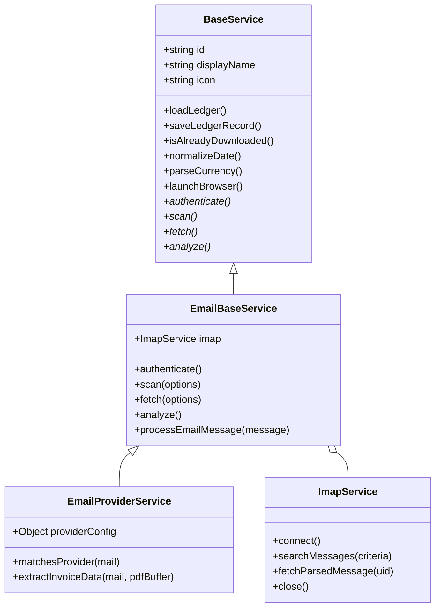

# Technical Research & Architecture Report: IMAP Email Invoice Fetcher & Parser Module for `invoice-scrape-agent`

## Executive Summary
Many modern mobility, food delivery, and micro-transit services (such as **Bolt**, **Lime**, **FreeNow**, **Flink**, **Wolt**) do not provide web portals with downloadable invoice PDFs. Instead, they issue receipts and tax invoices exclusively via email (either as PDF attachments or embedded HTML body text).

To seamlessly incorporate email-based receipt parsing into `invoice-scrape-agent`, we have designed an **IMAP Plugin Module Architecture**. This module integrates cleanly into the existing `BaseService`, `ServiceRegistry`, and `MasterAnalyzer` pipeline, allowing email scrapers to look, feel, and behave identically to browser-based scrapers.

---

## 1. Node.js Library Evaluation for IMAP & Email Parsing

### A. IMAP Client Library Comparison

| Feature / Criteria | `imapflow` (Recommended) | `node-imap` (`imap`) | `emailjs-imap-client` |
|---|---|---|---|
| **Maintenance** | Active (Postalsys / Nodemailer) | Deprecated / Unmaintained (8+ yrs) | Low activity |
| **Async Architecture** | Native Promises & Async Iterators (`for await...`) | Callback-based / EventEmitter | Promise-based (older API) |
| **OAuth2 / XOAUTH2** | Built-in native support | Complex manual SASL logic | Partial support |
| **IMAP Pipelining & IDLE**| Native support with high throughput | Poor concurrency control | Limited |
| **TLS & Security** | TLS 1.3, modern cipher defaults | Outdated default ciphers | Moderate |
| **Memory Footprint** | Low (supports streaming responses) | High (buffers messages in memory) | Moderate |

> **Verdict**: **`imapflow`** is the recommended IMAP library for Node.js 18+. It is actively maintained by Andris Reinman (creator of Nodemailer), handles modern async flow natively, streams email contents without high memory overhead, and supports both App Passwords and OAuth2 (XOAUTH2).

### B. Email Parser: `mailparser`
- **Library**: `mailparser` (Postalsys).
- **Functionality**: `simpleParser(streamOrBuffer)` parses raw RFC822 messages into structured JavaScript objects.
- **Key Benefits**:
  - Automatically handles MIME decoding, charsets (UTF-8, ISO-8859-1), base64, and quoted-printable encodings.
  - Extracts inline assets vs attachments (`attachment.contentType`, `attachment.filename`, `attachment.content` Buffer).
  - Returns sanitized HTML body content and clean headers (`message-id`, `date`, `from`, `subject`).

### C. Authentication Methods Supported
1. **App Passwords / TLS Basic Auth** (Gmail, Outlook, Fastmail, Web.de, GMX, custom domain IMAP):
   ```env
   IMAP_HOST=imap.gmail.com
   IMAP_PORT=993
   IMAP_USER=billing@mycompany.com
   IMAP_PASS=xxxx-xxxx-xxxx-xxxx
   IMAP_SECURE=true
   ```
2. **OAuth2 / XOAUTH2** (Google Workspace & Microsoft 365 Enterprise):
   ```js
   const client = new ImapFlow({
     host: process.env.IMAP_HOST,
     port: 993,
     secure: true,
     auth: {
       user: process.env.IMAP_USER,
       accessToken: process.env.IMAP_OAUTH2_ACCESS_TOKEN
     }
   });
   ```

---

## 2. Search & Filter Strategy + HTML-to-PDF / PDF Processing Pipeline

### A. IMAP Search Strategy & Filtering
To maximize speed and avoid parsing irrelevant emails:
- **Server-Side IMAP Search Criteria**:
  Combine `FROM`, `SUBJECT`, and `SINCE`/`BEFORE` parameters directly in the IMAP search command:
  ```js
  const searchCriteria = {
    from: providerConfig.search.from, // e.g. "receipts-germany@bolt.eu"
    since: options.startDate ? new Date(options.startDate) : undefined,
    before: options.endDate ? new Date(options.endDate) : undefined
  };
  const uids = await client.search(searchCriteria);
  ```
- **Deduplication & Incremental Fetching**:
  - Uniquely identify each email using its standard `Message-ID` header combined with the provider Order ID.
  - Before fetching email body/attachment, check `isAlreadyDownloaded(orderId)` against the service ledger to skip previously downloaded receipts.

### B. PDF Attachment Extractor vs HTML Email Converter

```
                          [ Parse Email via mailparser ]
                                        |
                         Is PDF Attachment Present?
                                  /           \
                             (YES)             (NO)
                              /                 \
        [ Extract PDF Attachment Buffer ]     [ Extract HTML Body ]
                      |                               |
       [ Save to invoices/<id>/<file>.pdf ]   [ Launch Playwright Page ]
                      |                               |
          [ Parse with pdf-parse ]            [ Inject CSS Print Fixes ]
                      |                               |
                      |                       [ Render A4 PDF via page.pdf() ]
                      |                               |
                      +--------------->---------------+
                                      |
                      [ Extract Netto, USt, Brutto ]
                                      |
                    [ Write Record to <id>_ledger.json ]
```

1. **Path A: PDF Attachments (e.g., FreeNow, Wolt)**
   - Scan `mail.attachments` for `contentType === 'application/pdf'` or filename matching `/\.pdf$/i`.
   - Save Buffer directly to disk: `invoices/<serviceId>/<date>_<orderId>.pdf`.
   - Extract text content using `pdf-parse` (already installed in `package.json`).

2. **Path B: HTML Email to A4 PDF Conversion (e.g., Bolt, Lime, Flink)**
   - Many ride-hailing/delivery services send receipts only as HTML emails.
   - **Rendering Engine**: Reuse existing **Playwright Chromium** instance (`BaseService.launchBrowser()`).
   - **Conversion Steps**:
     1. Pass `mail.html` content to Playwright: `await page.setContent(mail.html, { waitUntil: 'networkidle' })`.
     2. Inject CSS print rules to hide tracking links, unsubscribe footers, and force clean A4 margins:
        ```css
        @media print {
          body { font-size: 11pt; background: #ffffff !important; color: #000000 !important; }
          .no-print, .unsubscribe, .footer-links { display: none !important; }
        }
        ```
     3. Convert to A4 PDF:
        ```js
        await page.pdf({
          path: targetPdfPath,
          format: 'A4',
          printBackground: true,
          margin: { top: '15mm', bottom: '15mm', left: '15mm', right: '15mm' }
        });
        ```

---

## 3. Architecture Design & Integration into `invoice-scrape-agent`

### A. Core Class Hierarchy



1. **`ImapService`** (`services/base/ImapService.js`):
   Low-level connection wrapper for `imapflow` and `mailparser`. Handles login, folder selection, searching, streaming, and connection tear-down.

2. **`EmailBaseService`** (`services/base/EmailBaseService.js` - extends `BaseService`):
   Abstract base class providing standard lifecycle behavior (`authenticate()`, `scan()`, `fetch()`, `analyze()`) compatible with `index.js` CLI menus.

3. **`EmailProviderService`** (`services/base/EmailProviderService.js` - extends `EmailBaseService`):
   Generic concrete service class driven by a provider JSON configuration file. Enables adding providers (Bolt, Lime, etc.) with zero extra JavaScript code!

4. **`ServiceRegistry` Auto-Discovery Update**:
   Update `ServiceRegistry.autoDiscover()` to also scan `services/email/providers/*.json`. Automatically registers each email provider as a first-class service in `invoice-scrape-agent`.

### B. Shared JSON Ledger Alignment
Email scrapers populate the exact ledger schema used by `MasterAnalyzer` for generating `Gesamtauflistung_Master.pdf`:

```json
{
  "service": "bolt",
  "serviceDisplayName": "Bolt Mobility",
  "orderId": "BOLT-DE-2025-9812",
  "invoiceNumber": "DE-2025-4410",
  "date": "2025-05-12",
  "netto": 12.61,
  "ust": 2.39,
  "brutto": 15.00,
  "taxRate": "19%",
  "seller": "Bolt Operations OÜ",
  "currency": "EUR",
  "pdfPath": "invoices/bolt/2025-05-12_BOLT-DE-2025-9812.pdf",
  "updatedAt": "2026-08-07T07:15:00.000Z"
}
```

---

## 4. Provider Configuration Schema Specification

Below is the proposed JSON schema for defining new email providers (e.g. `services/email/providers/bolt.json`):

```json
{
  "$schema": "http://json-schema.org/draft-07/schema#",
  "id": "bolt",
  "displayName": "Bolt Mobility",
  "icon": "⚡",
  "authUrl": "imap://imap.gmail.com",
  "search": {
    "from": ["receipts-germany@bolt.eu", "receipts@bolt.eu"],
    "subjectKeywords": ["Deine Fahrt mit Bolt", "Your ride with Bolt"],
    "folders": ["INBOX", "[Gmail]/All Mail"]
  },
  "extraction": {
    "mode": "attachment_or_html",
    "attachmentRegex": "\\.pdf$",
    "htmlCssFixes": "@media print { body { font-size: 11pt; } .unsubscribe, .footer-links { display: none !important; } }"
  },
  "parser": {
    "currency": "EUR",
    "regex": {
      "orderId": "(?:Bestellnummer|Fahrts-ID|Trip ID):?\\s*([A-Z0-9-]+)",
      "invoiceNumber": "(?:Rechnungsnummer|Invoice No):?\\s*([A-Z0-9-]+)",
      "date": "(?:Datum|Date):?\\s*(\\d{2}\\.\\d{2}\\.\\d{4}|\\d{4}-\\d{2}-\\d{2})",
      "brutto": "(?:Gesamtbetrag|Total|Summe):?\\s*([0-9.,]+)\\s*€",
      "ust": "(?:enthaltene MwSt|USt|VAT\\s*\\(?19%\\)?):?\\s*([0-9.,]+)\\s*€",
      "seller": "(?:Bolt Operations OÜ|Bolt Technology OU)"
    },
    "aiFallback": true
  }
}
```

### AI-Assisted Structured Fallback Parsing (`@google/genai`)
When regex rules fail due to responsive email layout changes, `EmailBaseService` utilizes the existing `@google/genai` package to extract structured JSON:

```js
const { GoogleGenAI } = require('@google/genai');
const ai = new GoogleGenAI({});

async function extractInvoiceWithAI(emailText) {
  const response = await ai.models.generateContent({
    model: 'gemini-2.5-flash',
    contents: `Extract invoice details from this receipt text:\n\n${emailText}`,
    config: {
      responseMimeType: 'application/json',
      responseSchema: {
        type: 'OBJECT',
        properties: {
          orderId: { type: 'STRING' },
          invoiceNumber: { type: 'STRING' },
          date: { type: 'STRING' },
          netto: { type: 'NUMBER' },
          ust: { type: 'NUMBER' },
          brutto: { type: 'NUMBER' },
          taxRate: { type: 'STRING' },
          seller: { type: 'STRING' }
        },
        required: ['date', 'brutto', 'seller']
      }
    }
  });
  return JSON.parse(response.text);
}
```

---

## 5. Recommended Implementation Roadmap

1. **Install Dependencies**: `npm install imapflow mailparser`.
2. **Implement Core Base Classes**:
   - `services/base/ImapService.js`
   - `services/base/EmailBaseService.js`
   - `services/base/EmailProviderService.js`
3. **Add Initial Provider Profiles**: Add JSON configs for `bolt`, `lime`, `wolt`, `flink`, `freenow`.
4. **Extend CLI & Scaffolder**: Update `services/registry.js` and `services/generator/scaffold.js` to support selecting `[Browser Scraper]` vs `[Email IMAP Scraper]`.
